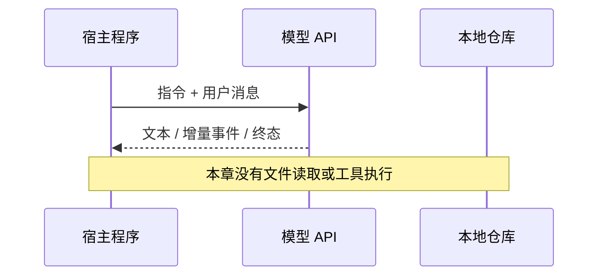
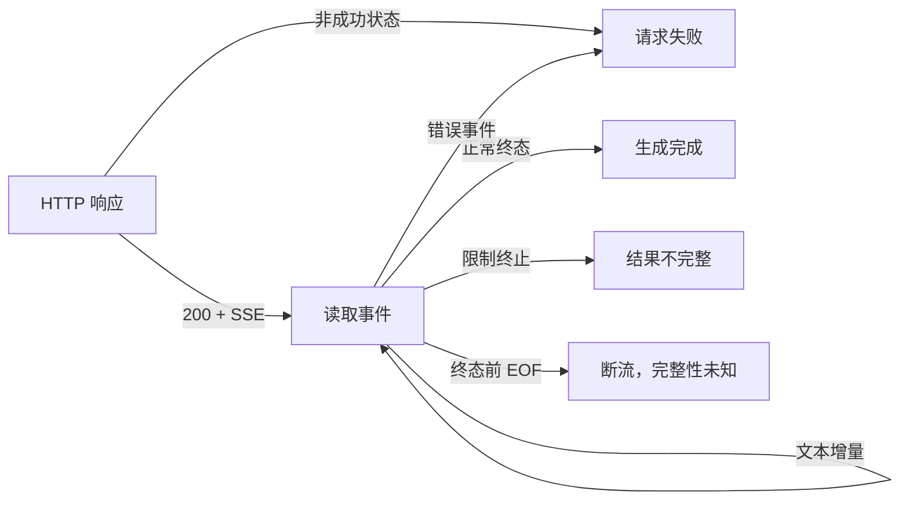

# 一次 LLM 调用：三类 API 与流式处理

你要给代码仓库接入一个助手。第一个需求很简单：**“解释 agent-decode 的用途，并给出依据。”**

先别创建 Agent 类，也别接工具。我们先解决一个足够具体的问题：**程序怎样发出一次模型请求，持续接收输出，并准确判断这次生成是完成、截断还是失败？**

本章默认你熟悉 HTTP、JSON 和基本异常处理，直接进入协议与代码。读完后，你应能实现三类 API 的文本客户端，解释它们为什么不能只替换 URL，也能指出“收到几个字”和“生成成功”之间还缺少哪些判断。

配套代码：[Python 标准库示例](../../examples/ch01_llm/README.md)。默认教学范围是单次、单候选、无工具的文本生成；多模态、并行工具与完整 Agent Loop 在后续章节展开。

## 1. 调用了模型，不等于读过仓库

第一版请求只发送这句话：

```text
请解释 agent-decode 的用途，并给出依据。
只使用本次输入中的信息；资料不足时说明还需要哪些材料。
```

这次 HTTP 请求里没有 README、源码或文件工具。无论模型回答正确、拒绝推测，还是根据名称猜测，**客户端都没有执行“读取当前仓库”这个动作**。模型可能在训练或其他上下文中见过同名项目，但这不能证明它理解了你当前检出的版本。

这一章先建立模型 I/O 边界。下一章才会把“需要更多材料”变成可执行的工具请求。



LLM 在这里提供的是条件生成能力：输入消息经过模型处理，输出 token 再被服务端编码为 API 响应。Agent 所需的工具执行、任务状态、权限和验证，都不能从“一次生成调用”自动得到。

## 2. 所谓“三大协议”，实际比较哪一层？

本课程用“三类 API”指 **OpenAI Chat Completions、OpenAI Responses、Anthropic Messages**。它们不是三种网络传输协议，也不代表行业只有这三种接口；差异主要在请求 Schema、消息模型和事件语义。

```text
业务代码：我要得到什么结果，如何判断成功？
    ↓
API 语义：messages / input / content blocks / status
    ↓
序列化：普通 JSON 或 SSE 中的 JSON 事件
    ↓
HTTP 与底层网络传输
```

“OpenAI-compatible”也不是对所有字段与行为的保证。一个服务可能兼容 Chat Completions 的基本文本字段，却不支持 Responses、完整工具 Schema、usage 事件或某些停止原因。适配应以实际支持范围为准。

| 对比项 | Chat Completions | Responses | Messages |
| --- | --- | --- | --- |
| 典型端点 | `POST /v1/chat/completions` | `POST /v1/responses` | `POST /v1/messages` |
| 鉴权 | `Authorization: Bearer …` | `Authorization: Bearer …` | `x-api-key: …`，并提供 `anthropic-version` |
| 指令位置 | `messages` 中的 `system`／`developer`，按模型支持选择 | 顶层 `instructions`，也支持结构化输入项 | 顶层 `system`；不是 `messages` 中一个同名角色 |
| 用户输入 | `messages` | `input`：字符串或结构化输入项 | `messages`，内容可为字符串或内容块 |
| 普通响应主体 | `choices[]` 中的 `message` | `output[]` 中的不同类型 item | `content[]` 中的不同类型 block |
| 输出限制字段 | `max_completion_tokens` | `max_output_tokens` | `max_tokens`，请求中需提供 |
| 正常文本流增量 | `choices[i].delta.content` | `response.output_text.delta` | `content_block_delta` 中的 `text_delta` |
| 停止／状态 | `finish_reason` | `status`、失败／不完整原因 | `stop_reason` |

这些是本章使用的官方接口形状。具体模型支持的角色、采样参数、推理选项和 token 限制可能不同；不要为了“字段一致”把不支持的参数无条件发送给所有模型。

### 2.1 Chat Completions：围绕消息和候选答案

下面三个请求都省略 HTTP 头，模型名由运行参数替换。响应片段均为**人工构造的结构示意，不是真实调用记录**。

```json
{
  "model": "<OPENAI_MODEL>",
  "messages": [
    {"role": "system", "content": "只依据提供的信息回答；资料不足时说明缺口。"},
    {"role": "user", "content": "请解释 agent-decode 的用途，并给出依据。"}
  ],
  "max_completion_tokens": 512,
  "stream": false
}
```

典型响应片段：

```json
{
  "choices": [{
    "index": 0,
    "message": {"role": "assistant", "content": "请提供 README 或源码片段。"},
    "finish_reason": "stop"
  }],
  "usage": {"prompt_tokens": 36, "completion_tokens": 10, "total_tokens": 46}
}
```

本章固定单候选，因此读取 `choices[0]`；如果支持多个候选，应按 `index` 分开聚合。`message.content` 也不是所有场景都存在的字符串：工具调用、拒绝或其他输出形态需要独立判断。

`finish_reason="stop"` 是生成结束原因，不证明答案正确；`length` 表示触及生成限制，不能当成完整答案。工具请求通常对应 `tool_calls`，下一章处理。

### 2.2 Responses：围绕输入项、输出项与生命周期

```json
{
  "model": "<OPENAI_MODEL>",
  "instructions": "只依据提供的信息回答；资料不足时说明缺口。",
  "input": "请解释 agent-decode 的用途，并给出依据。",
  "max_output_tokens": 512,
  "store": false,
  "stream": false
}
```

典型响应片段：

```json
{
  "status": "completed",
  "output": [{
    "type": "message",
    "role": "assistant",
    "content": [{"type": "output_text", "text": "请提供 README 或源码片段。"}]
  }],
  "usage": {"input_tokens": 36, "output_tokens": 10, "total_tokens": 46}
}
```

Responses 的 `output` 不只是一个答案字符串，还可能包含推理项、工具调用等。文本提取应遍历 message 的 `content`，筛选 `output_text`，不能假设 `output[0]` 一定是正文。

SDK 示例里常见的 `response.output_text` 是便捷属性。**直接处理 HTTP JSON 时，应按原始 `output` 结构解析，不把 SDK 的聚合属性当成所有响应都会携带的字段。**

Responses 还提供服务端状态衔接能力，例如 `previous_response_id`。它与“客户端只发当前一条消息却自动拥有永久记忆”不是一回事：使用哪些输入、是否存储、怎样衔接，以及新请求的指令，都需要按接口约定管理。本章使用独立请求并设置 `store=false`，不启用会话衔接；这也不等同于对所有服务端数据保留政策作保证。

### 2.3 Messages：围绕类型化内容块

请求头需要 Anthropic 的 API key 和版本头，例如本章使用的 `anthropic-version: 2023-06-01`。

```json
{
  "model": "<ANTHROPIC_MODEL>",
  "system": "只依据提供的信息回答；资料不足时说明缺口。",
  "messages": [{"role": "user", "content": "请解释 agent-decode 的用途，并给出依据。"}],
  "max_tokens": 512,
  "stream": false
}
```

典型响应片段：

```json
{
  "type": "message",
  "role": "assistant",
  "content": [{"type": "text", "text": "请提供 README 或源码片段。"}],
  "stop_reason": "end_turn",
  "usage": {"input_tokens": 36, "output_tokens": 10}
}
```

`content` 是内容块数组，不是“正文永远位于第零项”的契约。正文块、工具块、思考块有不同的结构；文本客户端可以只处理正文，但应明确自己的支持范围，不能把被忽略的工具调用算作成功执行。

`end_turn`、`max_tokens`、`tool_use` 表示不同结束原因。三种 API 的限制字段虽然相似，也不能直接拿配置值比较最终可见字数：token 不是字符；某些模型的输出预算还包含推理消耗。

## 3. 同样返回文本，为什么不能写成一个通用 JSON 路径？

非流式的最小文本提取可以写成三段明确的分支：

```python
# 结构示意：提取文本前后，还需要校验响应形状与终态。
chat_text = response["choices"][0]["message"]["content"]

responses_text = "".join(
    part["text"]
    for item in response["output"]
    if item["type"] == "message"
    for part in item["content"]
    if part["type"] == "output_text"
)

messages_text = "".join(
    block["text"] for block in response["content"] if block["type"] == "text"
)
```

这三段代码分别对应三个不同的响应对象。不要将它们对同一个 JSON 依次执行。

真正值得统一的是业务层最小结果，例如文本、用量和结束原因，而不是强行抹掉底层信息：

```text
可显示文本 + 协议原始结束原因 + 用量（可能缺失）+ 是否完整
```

面向 Agent 的客户端还要保留类型化内容、调用 ID 和工具参数。只返回一个字符串，会让下一章的工具请求无处安放。本章示例刻意只实现文本投影，遇到不支持的输出会报错；这是一项教学客户端策略，不是 API 规定“非文本输出都非法”。

## 4. 回答很长，为什么不等完整 JSON？

普通响应需要等整次生成结束，客户端才拿到正文。流式响应让程序在生成过程中接收增量，降低可感知的等待时间，并提前展示进度。

这不意味着模型的总生成速度必然提高。需要分别观察：

- **首个可见文本延迟**：从请求开始到首个正文增量。第一个流事件可能只是元数据，不等于第一个文本 token；有些系统将 TTFT 定义为模型侧时间，比较指标前先统一口径。
- **总耗时与输出速率**：请求到终态的时间，以及生成阶段的 token 速率。短输出、推理时间和网络缓冲都会影响测量。
- **完整性**：用户已经看到前半段，不代表后半段一定能收到。

从推理过程看，模型通常先处理输入上下文（prefill），再逐步生成输出（decode）。流式主要改变客户端何时看到生成结果，不会凭空消除输入处理、排队或推理耗时。长上下文与缓存命中可能影响首个输出延迟，但需要结合具体服务测量，不能只从 `stream=true` 推断性能。

如果上游在持续发送，而你的 HTTP 客户端、代理或前端仍一次性缓冲全部内容，界面照样不会逐步显示。流式是一条端到端的数据路径。

### 4.1 SSE event 不是网络 chunk，更不是一个 token

本章使用 HTTP POST 获取 SSE 响应，典型响应类型为 `text/event-stream`。SSE 数据按 UTF-8 编码，一个事件可以包含 `event:`、一行或多行 `data:`，以空行结束：

```text
event: response.output_text.delta
data: {"type":"response.output_text.delta","delta":"需要 README"}

```

必须分清三层边界：

```text
read() 得到的一段 bytes
    ≠ 一个完整 UTF-8 字符
    ≠ 一个完整 SSE event
    ≠ 一个完整模型 token
```

一次网络读取可能包含半个中文字符、半个 JSON、多个 SSE 事件，也可能恰好停在 `\r` 与 `\n` 之间。不要直接对每次 `read()` 执行 `decode()` 再 `json.loads()`。

合理的解析顺序是：

```text
bytes 分片
  → 增量 UTF-8 解码
  → 按 LF / CRLF / CR 切行
  → 收集一个 SSE 事件的各字段
  → 空行提交事件，多行 data 用换行连接
  → 按 API 解析完整 data
  → 按输出位置聚合正文、用量与终态
```

以冒号开头的行是注释，常用于心跳；空 `data:` 行仍是数据行；其他 SSE 字段应按用途处理。Chat 的 `[DONE]` 不是 JSON，要在 JSON 解析之前识别。EOF 不是补出来的空行，更不是模型成功结束的依据。

浏览器原生 `EventSource` 面向 GET 订阅，不能直接照搬到需要 POST 请求体和自定义鉴权头的模型请求。浏览器应用通常由后端保管 API key，再通过 `fetch` 的流或自己的转发接口接收事件。

### 4.2 Chat Completions：增量消息 + finish reason + 结束哨兵

请求设为 `stream=true`；如需最终用量，加入 `stream_options: {"include_usage": true}`。简化事件序列如下：

```text
data: {"choices":[{"index":0,"delta":{"role":"assistant","content":""},"finish_reason":null}]}

data: {"choices":[{"index":0,"delta":{"content":"需要 "},"finish_reason":null}]}

data: {"choices":[{"index":0,"delta":{"content":"README"},"finish_reason":null}]}

data: {"choices":[{"index":0,"delta":{},"finish_reason":"stop"}]}

data: {"choices":[],"usage":{"prompt_tokens":36,"completion_tokens":10,"total_tokens":46}}

data: [DONE]

```

三个容易写错的位置：

1. 用 `delta.content` 追加正文，不把每个 chunk 当成完整 `message`。
2. **先处理 usage，再检查 choices**。最终用量块可能是空 `choices`，直接访问 `choices[0]` 会报错，先跳过空 choices 又会丢用量。
3. 记录 `finish_reason`，不要在它出现时立刻关闭流，否则可能丢掉随后到达的用量。结束哨兵也不解释为何结束，要与 finish reason 一起判断。

本章的严格回放规则同时要求已收到有效结束原因和 `[DONE]`；它不尝试兼容省略这些信号的第三方接口。真实兼容层是否容忍缺失，必须明确记录，不能悄悄把断流算成完成。

### 4.3 Responses：正文片段结束，不等于整个响应完成

```text
event: response.created
data: {"type":"response.created","response":{"status":"in_progress"}}

event: response.output_text.delta
data: {"type":"response.output_text.delta","item_id":"msg_demo","output_index":0,"content_index":0,"delta":"需要 README"}

event: response.output_text.done
data: {"type":"response.output_text.done","item_id":"msg_demo","output_index":0,"content_index":0,"text":"需要 README"}

event: response.completed
data: {"type":"response.completed","response":{"status":"completed","usage":{"input_tokens":36,"output_tokens":10,"total_tokens":46}}}

```

这是为了说明正文与终态而删减过的轨迹；完整流还包含输出项与内容部分的生命周期事件。

`response.output_text.done` 只结束某个文本部分；`response.output_item.done` 只结束某个输出项。整个请求还可能继续产生其他内容，最终也可能失败。因此完整性要看响应级事件：

- `response.completed`：响应完成。
- `response.incomplete`：响应不完整，需要读取 `incomplete_details`。
- `response.failed` 或流内错误事件：失败，需要处理错误信息。

如果已经拼接过 delta，就不要再把 `.done` 事件里的完整文本追加一次，否则答案会重复。生产实现可以用最终快照校正增量结果，但“替换／校验”与“再次追加”是不同操作。

多个内容部分还需按 `output_index`、`content_index` 等身份聚合，不能把所有事件的任意 `delta` 字段都当成正文。工具参数 delta 与正文 delta 完全不同。

### 4.4 Messages：消息生命周期中嵌套内容块生命周期

```text
event: message_start
data: {"type":"message_start","message":{"content":[],"usage":{"input_tokens":36,"output_tokens":0}}}

event: content_block_start
data: {"type":"content_block_start","index":0,"content_block":{"type":"text","text":""}}

event: content_block_delta
data: {"type":"content_block_delta","index":0,"delta":{"type":"text_delta","text":"需要 README"}}

event: content_block_stop
data: {"type":"content_block_stop","index":0}

event: message_delta
data: {"type":"message_delta","delta":{"stop_reason":"end_turn","stop_sequence":null},"usage":{"output_tokens":10}}

event: message_stop
data: {"type":"message_stop"}

```

这里也有两层结束：`content_block_stop` 结束一个 block，`message_stop` 才结束整条消息。`message_delta` 提供最终停止原因及用量更新，不能只等待正文块结束就返回成功。

正文按 `index` 归属到对应 block。`content_block_delta` 还可能携带工具输入的 JSON 片段等其他增量，只有 `text_delta` 才是这里要显示的正文。

`message_delta` 中的 token 用量是累计值，不能把每次出现的 `output_tokens` 相加。起始事件有输入用量，后面的更新可能不包含该字段；应按出现的字段更新，保留未更新的值。缓存等扩展统计也不要用猜测填充。

## 5. HTTP 200 之后，还能失败吗？

能。HTTP 状态在响应头阶段就已确定，模型生成可能还在进行。后续服务过载或其他错误可以作为 SSE 事件发出，连接也可能在终态之前中断。



至少保留四个判断维度：HTTP 请求是否建立、正文是否已经产生、API 是否达到正常终态、业务结果是否满足任务。前面三个成立，也不能替代最后一个。

| 情况 | 处理方式 | 不应做的推断 |
| --- | --- | --- |
| 401／403 | 报告认证或权限失败 | 靠解析空 choices 恢复 |
| 429／5xx | 按明确策略决定是否重试；本章直接报错 | 所有失败都无限重试 |
| HTTP 200 后收到 error | 标记本次生成失败；已展示文本是部分结果 | HTTP 成功，所以正文完整 |
| 正文已到，但终态前 EOF | 报告断流 | 将 EOF 当成 stop |
| `length`／`max_tokens`／Responses incomplete | 保留部分文本与限制原因 | 只要有正文就算完成 |
| 正常终态但拒绝回答 | 单独识别拒绝／过滤等语义 | 完成等于满足用户任务 |
| usage 缺失 | 记录未知；中断时尤其可能发生 | 把未知当成零 token |

本章示例不自动重试，目的是让失败语义可观察。以后引入重试时，还要处理已经显示的部分文本、重复请求的成本与日志关联。SSE 的事件 ID 或“客户端重新连接”不自动提供模型请求的精确续传；是否能恢复必须由具体 API 支持。

用户取消时，应关闭响应流并停止消费；客户端关闭连接不保证服务端已停止生成，也不保证此前生成不计费。完整的任务取消与工具进程终止会在后续章节分别讨论。

## 6. 可运行示例：把三种语义放到同一组实验里

配套示例使用 Python 3.10+ 标准库，不安装模型 SDK。目的不是替代 SDK，而是把 SDK 常常隐藏的 HTTP、SSE 和事件聚合边界展示出来。

先运行人工构造的离线轨迹，观察三个接口的输出与终态：

```bash
python3 examples/ch01_llm/client.py --api chat --stream --demo
python3 examples/ch01_llm/client.py --api responses --stream --demo
python3 examples/ch01_llm/client.py --api messages --stream --demo
```

去掉 `--stream` 可以观察非流式解析。`--demo` 不联网、不读取 API key；它证明的是客户端如何处理样本，不能证明某个模型真的给出过这些回答。

真实调用时，使用自己的环境变量和账户可用模型。不要把 API key 写进仓库：

```bash
# 前提：已在当前进程环境配置相应 API key 和模型变量。
python3 examples/ch01_llm/client.py --api chat --model "$OPENAI_MODEL" --stream
python3 examples/ch01_llm/client.py --api responses --model "$OPENAI_MODEL" --stream
python3 examples/ch01_llm/client.py --api messages --model "$ANTHROPIC_MODEL" --stream
```

Chat／Responses 读取 `OPENAI_API_KEY`，Messages 读取 `ANTHROPIC_API_KEY`。模型名由 `--model` 显式传入；模型可用性与接口支持由你的账户决定。

实现分成三层，源码和具体命令见 [示例说明](../../examples/ch01_llm/README.md)：

1. **请求构造**：保留三个 API 的不同字段与头信息。
2. **SSE 帧解析**：只负责 UTF-8、行与事件边界，不理解模型语义。
3. **协议聚合**：提取正文、更新用量、检查停止原因；失败或不完整以非零退出报告。

示例按已支持的顺序文本事件追加显示，不提供通用的多输出索引重排；Responses 最终文本还会与增量结果核对。需要并行工具、多种 block 或完整事件重建时，应保留 item／block 身份，下一节沿 Codex 的内部事件与完成状态观察生产边界，并用 Pi 补充协议差异。

网络层使用 `read1(4096)` 向 SSE 解析器提供可用字节，而不是先读完整响应再处理。这里的 4096 是读取上限，不是协议帧大小；60 秒 socket 超时也不是整个生成任务的总时限。

建议先运行回放，再故意删除终态或换成限制结束，观察“终端已经打印正文，但程序最终失败”的情况。失败之后保留部分输出有助于诊断，但调用方必须检查退出状态。

运行离线测试：

```bash
python3 -m unittest discover -s examples/ch01_llm -p 'test_*.py' -v
```

关键测试对象不是“正常 JSON 能否取出 text”，而是跨字节分片的中文、CRLF、空 choices 用量块、文本 done 与响应 done 的区别，以及终态前断流。测试通过仍不覆盖官方服务连通性、真实模型选择或第三方兼容性。

## 7. 真实项目怎样处理：沿 Codex 的 Responses 链路阅读

源码学习以 **OpenAI Codex** 为主。以下依据固定提交 `5b1d6560181680f95cde95c14ed042acc02248ed`，只读核实请求与流处理代码，未运行 Codex 的集成测试。完整快照信息见 [源码案例调研](../source-study.md)。

这里沿 Codex 的 **Responses HTTP/SSE 路径**观察生产实现。Codex 还存在 WebSocket 路径，不能将本节描述成它唯一的传输方式；本章讲解三类 API，也不意味着 Codex 实现了这三类 API。

```text
ModelClientSession 调用 ModelClient 构造 Responses 请求
    → ResponsesClient 发出 HTTP 请求
    → SSE 解码并解释 Responses 事件
    → 内部文本／输出项／完成事件
    → 上层消费事件，推进当前回合
```

### 7.1 请求构造：输入不只是一个 prompt 字符串

[`core/src/client.rs` 的 `build_responses_request`](https://github.com/openai/codex/blob/5b1d6560181680f95cde95c14ed042acc02248ed/codex-rs/core/src/client.rs#L794-L899)先整理输入与工具定义，再构造 `ResponsesApiRequest`。在常规 Responses 路径中，可以对照本章的 `input`、`instructions`、`tools`、`stream` 和 `store` 等字段。

这里已经能看出 Harness 的职责：它组织本次调用需要的上下文、工具与运行配置，再交给 API 客户端。模型不会自行从工作目录中收集这些输入。

此函数还包含 `use_responses_lite` 等生产分支。首次阅读先沿常规分支走通，其他分支单独标注，不把条件不同的实现拼成一个虚构的请求格式。

### 7.2 HTTP 传输与协议解析分开

[`codex-api/src/endpoint/responses.rs` 的 `stream_encoded`](https://github.com/openai/codex/blob/5b1d6560181680f95cde95c14ed042acc02248ed/codex-rs/codex-api/src/endpoint/responses.rs#L155-L190)发出 POST 请求，设置 `Accept: text/event-stream`，再通过 `spawn_response_stream` 把响应交给流处理逻辑，同时传入空闲超时配置。

这一层负责建立流，并不根据几段文本判断任务是否完成。HTTP、SSE 分帧、Responses 事件语义分别有自己的边界；本章示例采用相同的职责划分，但没有复刻 Codex 的完整网络栈。

### 7.3 将协议事件转换成内部事件

[`codex-api/src/sse/responses.rs` 的 `process_responses_event`](https://github.com/openai/codex/blob/5b1d6560181680f95cde95c14ed042acc02248ed/codex-rs/codex-api/src/sse/responses.rs#L353-L510)区分几类事件：

| 上游事件 | Codex 在此处的处理 | 对上层的意义 |
| --- | --- | --- |
| `response.output_text.delta` | 转为 `OutputTextDelta` | 有正文可以展示，不代表整次响应完成 |
| `response.output_item.done` | 转为 `OutputItemDone` | 一个结构化输出项完成，后续可以按类型处理 |
| `response.completed` | 产生包含响应 ID、用量等信息的 `Completed` | 本次模型响应达到完成状态 |
| `response.incomplete` | 产生包含不完整原因的错误 | 不能悄悄当作正常完成 |
| `response.failed` | 转为错误 | 进入失败处理路径 |

内部事件保留了文本、输出项和整次响应的区别。这比“统一返回一个字符串”更适合 Agent：下一章的工具调用会出现在结构化输出项里，不能被文本拼接逻辑吞掉。

### 7.4 响应完成，不依赖连接恰好关闭

同文件的 [SSE 消费循环](https://github.com/openai/codex/blob/5b1d6560181680f95cde95c14ed042acc02248ed/codex-rs/codex-api/src/sse/responses.rs#L568-L681)对等待事件设置空闲超时，处理传输错误，并把 `response.completed` 之前的 EOF 视为失败。收到内部 `Completed` 后即可返回，不必再等连接关闭。

这里需要保留两个实现细节：部分协议错误先被记录，随后在流结束时报告；无法解析的事件 JSON 会记录日志并跳过。因此不能将它概括成“任何异常事件都会立即中止”。阅读生产源码，要看错误如何传播，而不只看分支里有没有创建错误对象。

本章教学客户端选择更严格的未知事件处理，并在流消费结束时检查终态。两者的策略不完全相同，但都要求区分**传输结束与协议完成**。这条 HTTP/SSE 路径也不覆盖 Codex 的[WebSocket 与 HTTP 回退分支](https://github.com/openai/codex/blob/5b1d6560181680f95cde95c14ed042acc02248ed/codex-rs/core/src/client.rs#L1964-L2018)。

### 7.5 补充对比：什么时候值得看 Pi？

当问题涉及另外两类 API，或需要比较统一事件层的取舍时，再引入 Pi。以下对应其固定提交 `71dca871bc80b6bc97be37f0ca3189399d651fff`：

- [Chat 的 usage 与 choices 处理](https://github.com/earendil-works/pi/blob/71dca871bc80b6bc97be37f0ca3189399d651fff/packages/ai/src/api/openai-completions.ts#L558-L592)：先收 usage，再判断是否有 choice，避免丢掉空 choices 用量块；这里消费的是 SDK chunk，不是自行解析原始 SSE。
- [Responses 的终态归一化](https://github.com/earendil-works/pi/blob/71dca871bc80b6bc97be37f0ca3189399d651fff/packages/ai/src/api/openai-responses-shared.ts#L741-L784)：token 上限导致的 incomplete 可以映射为内部 `length`，与上述 Codex 分支的错误表示不同。对比时要继续看上层怎样处理，不能仅凭名称判断优劣。
- [Messages 的内容块处理](https://github.com/earendil-works/pi/blob/71dca871bc80b6bc97be37f0ca3189399d651fff/packages/ai/src/api/anthropic-messages.ts#L621-L696)：按索引保留不同 block 的归属，展示多类型内容为什么不能一律拼成正文。

主线仍然是同一个问题：宿主怎样把模型输出变成可观察、可判断、可继续执行的状态。Codex 给出主要工程案例，其他项目用来说明有实质差异的实现选择。

## 8. 面试追问：从实现推导答案

下面是围绕本章机制整理的备考问题，不代表经过统计的出现频率。回答时先说边界和原因，再给代码中的例子。

### “三类 API 都能调模型，为什么还需要适配层？”

差异不只在 URL。指令位置、输入结构、输出项类型、工具定义、流事件与结束原因都不同。可以统一文本／事件接口，但必须保留调用 ID、原始停止原因等关键信息；一律压成字符串会阻断工具调用和错误恢复。

### “流式输出是不是模型每生成一个 token 就发一次 SSE？”

不是保证。服务端可能缓冲或合并输出；网络读取还可能拆分一个事件。token 边界、SSE 帧边界和网络分片边界属于不同层次。用中文跨字节分片测试，可以直接证明不能逐块盲目解码。

### “为什么使用 SSE，不直接用 WebSocket？”

一次请求、服务端持续返回事件的场景用 HTTP + SSE 就能表达，也容易接入现有 HTTP 基础设施。WebSocket 适合需要双向、持续交互或特定 API 支持的场景，但不自动解决事件聚合、取消与完整性。选择应由交互模型和服务端接口决定，不是哪个名字更先进。

### “收到 HTTP 200、文本 done、正常终态分别证明什么？”

HTTP 200 表明响应已开始成功返回；文本 done 只说明某个文本部分结束；正常响应终态说明本次生成完成。它们都不证明答案有依据、工具执行成功或业务任务完成。断流、token 上限和多个输出部分是很好的追问案例。

### “为什么 usage 不能简单逐事件相加？”

有的接口只在最后给统计，有的字段是累计值；Chat 的最终 usage 还可能放在空 choices 块中。必须按 API 更新语义处理。缺失不是零，`max_*_tokens` 也不是最终消耗，更不是可见字符数。

### “流式断开，自动重试不就好了？”

重试通常会创建新生成，未必从断点继续。你需要处理已显示的部分文本、重复成本与状态关联；到了工具章节还要考虑重复副作用。本章故意不自动重试，让调用方先能识别失败。

### “把历史消息放进请求，和模型拥有记忆有什么区别？”

历史消息是本次推理输入的一部分，受上下文窗口约束。服务端响应衔接也是显式 API 能力；长期记忆还涉及持久化、检索、更新、作用域与失效策略，不能由一次请求字段直接推导出来。

## 9. 新问题：怎样让模型提出一个可执行的请求？

现在我们能可靠收取普通或流式回答，却仍然没有给模型仓库内容。把 README 全部手工塞进 prompt 可以解决一个小例子，但无法让它自行决定下一步还需要哪个文件。

三类 API 都可以描述客户端工具，但形状不同：

| API | 函数工具定义的典型形状 | 工具请求的典型位置 |
| --- | --- | --- |
| Chat Completions | `tools[].type="function"`，定义放在 `tools[].function` | assistant 的 `tool_calls[]` |
| Responses | `tools[].type="function"`，`name`、`parameters` 等在工具项顶层 | `output[]` 的 `function_call` 项 |
| Messages | `tools[]` 使用 `name`、`description`、`input_schema` | assistant 内容中的 `tool_use` 块 |

这个字段描述的是“有哪些工具可供请求”，不是把 Python 函数上传给模型执行。本章示例没有发送 `tools`，也不会运行工具。

**下一章的问题是：模型返回了工具名、参数和调用 ID，究竟谁来校验并执行？** 我们先观察请求，再在之后的章节接入受限的只读文件工具，最后把结果回传串成 Agent Loop。

回到 [课程路线](../curriculum-roadmap.md)，可以看到权限、MCP、上下文和 Sandbox 将从这些边界继续展开。

## 参考与验证范围

核对日期为 2026-09-17。OpenAI 文档页面本次返回 403，Anthropic 文档页面重定向到地区不可用页面，因此字段与事件语义改用**官方 SDK 的接口类型和流实现**核对；WHATWG SSE 标准可直接读取。下列提交是源码快照，不是本项目安装的 SDK 版本，本章示例也不依赖这些 SDK。

| 主题 | 官方依据 |
| --- | --- |
| Chat 请求与输出预算 | [OpenAI 请求类型](https://github.com/openai/openai-python/blob/b77076d23b6f3e34453b0fadd8cd2a001627e365/src/openai/types/chat/completion_create_params.py#L43-L132) |
| Chat delta 与结束原因 | [ChatCompletionChunk](https://github.com/openai/openai-python/blob/b77076d23b6f3e34453b0fadd8cd2a001627e365/src/openai/types/chat/chat_completion_chunk.py#L62-L121) |
| Chat 空 choices 用量块与 DONE | [流选项说明](https://github.com/openai/openai-python/blob/b77076d23b6f3e34453b0fadd8cd2a001627e365/src/openai/types/chat/chat_completion_stream_options_param.py#L24-L32) |
| Responses 输入与输出预算 | [Responses 请求类型](https://github.com/openai/openai-python/blob/b77076d23b6f3e34453b0fadd8cd2a001627e365/src/openai/types/responses/response_create_params.py#L84-L109) |
| 原始 output 与 SDK output_text | [SDK 聚合属性实现](https://github.com/openai/openai-python/blob/b77076d23b6f3e34453b0fadd8cd2a001627e365/src/openai/types/responses/response.py#L547-L561) |
| 文本结束与整个响应结束 | [text done](https://github.com/openai/openai-python/blob/b77076d23b6f3e34453b0fadd8cd2a001627e365/src/openai/types/responses/response_text_done_event.py#L35-L58)、[response completed](https://github.com/openai/openai-python/blob/b77076d23b6f3e34453b0fadd8cd2a001627e365/src/openai/types/responses/response_completed_event.py#L11-L21) |
| Messages 输入、system 与 max_tokens | [Anthropic 请求类型](https://github.com/anthropics/anthropic-sdk-python/blob/7e5ca5c94126a6d7de159a169ff43eb9b1cac57f/src/anthropic/types/message_create_params.py#L33-L113) |
| Messages 停止原因 | [Message 类型](https://github.com/anthropics/anthropic-sdk-python/blob/7e5ca5c94126a6d7de159a169ff43eb9b1cac57f/src/anthropic/types/message.py#L80-L97) |
| Messages 内容索引与累计用量 | [官方流聚合实现](https://github.com/anthropics/anthropic-sdk-python/blob/7e5ca5c94126a6d7de159a169ff43eb9b1cac57f/src/anthropic/lib/streaming/_messages.py#L450-L534) |
| 三类函数工具定义 | [Chat function](https://github.com/openai/openai-python/blob/b77076d23b6f3e34453b0fadd8cd2a001627e365/src/openai/types/chat/chat_completion_function_tool_param.py#L12-L18)、[Responses function](https://github.com/openai/openai-python/blob/b77076d23b6f3e34453b0fadd8cd2a001627e365/src/openai/types/responses/function_tool_param.py#L20-L37)、[Messages tool](https://github.com/anthropics/anthropic-sdk-python/blob/7e5ca5c94126a6d7de159a169ff43eb9b1cac57f/src/anthropic/types/tool_param.py#L31-L43) |
| SSE 字节、行与事件解析 | [WHATWG：Parsing an event stream](https://html.spec.whatwg.org/multipage/server-sent-events.html#parsing-an-event-stream) |

可运行示例的离线测试验证解析器和客户端策略；本章没有附真实模型调用记录，不将人工轨迹包装成线上结果。真实项目案例的行为结论来自上文固定提交，也不替代运行时验证。
