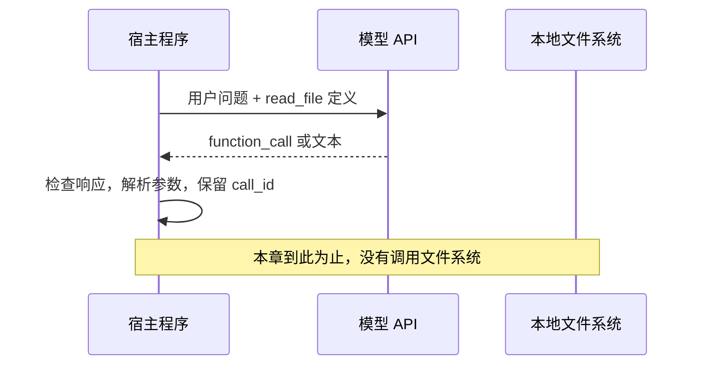

# 模型说要读文件，文件就会被读取吗？

[第一章](01-llm-apis-and-streaming.mdx)已经能调用模型并判断响应是否完整，但没有解决资料来源：让模型解释 agent-decode，它仍然没有拿到当前仓库的 README。

这次我们告诉模型：有一个名为 `read_file` 的工具，可以请求读取文件。观察它会直接回答，还是返回一份读取请求。

**本章新增的是工具请求的表达与识别，不是文件读取能力。** 示例不会打开目标文件，不回传工具结果，也不会自动开始下一轮。读完后，你应能解释：模型看到了什么、返回了什么，以及宿主还必须完成哪些工作。

配套代码：[第二章示例](../../examples/ch02_tool_call/README.md)。沿用第一章的 Python 标准库实现，以 OpenAI Responses 为主要实验接口，以 Codex 为源码案例。

## 1. 先区分三个对象

假设用户问：“读取 README.md，解释这个仓库的用途。”这里会涉及三种不同的数据：

| 对象 | 谁提供 | 内容 | 是否意味着读取完成 |
| --- | --- | --- | --- |
| 工具定义 | 宿主发给模型 | 名称、描述、参数结构 | 否，仅描述可请求的能力 |
| 工具调用请求 | 模型输出 | 工具名、参数、调用 ID | 否，仅表达一次行动请求 |
| 工具执行结果 | 宿主执行后产生 | 文件内容或错误，关联原调用 | 表明执行有了结果，还需区分成功与失败 |

Function Calling 不是把 Python 函数发送给模型，也不是模型在服务端自动调用你机器上的函数。这里讨论的是**客户端自定义函数工具**；服务商托管的搜索等工具可能有不同执行位置，不能混为一谈。



## 2. 模型为什么能输出结构化的调用请求？

工具定义告诉模型可选动作的语义和参数形状。模型在训练与推理接口的支持下生成结构化调用输出；宿主随后解析它。不要把这套过程想象成 API 服务用字符串搜索“读取文件”，再硬编码执行一个函数。

定义一个本课程自建的工具：

```json
{
  "type": "function",
  "name": "read_file",
  "description": "请求读取工作区内的 UTF-8 文本文件，用于获取回答所需的源码或文档依据。",
  "parameters": {
    "type": "object",
    "properties": {
      "path": {
        "type": "string",
        "description": "相对于工作区根目录的文件路径，例如 README.md"
      }
    },
    "required": ["path"],
    "additionalProperties": false
  },
  "strict": true
}
```

这不是 Codex 某个工具定义的逐字复制，而是最小教学工具。

- `name` 是分发时使用的稳定标识，不是人类显示标题。
- `description` 帮助模型判断何时使用，以及输入的含义。描述含糊会影响选择，但写得详细也不构成权限限制。
- `parameters` 约束参数对象的结构。此例要求 `path` 为字符串，不接受额外属性。
- `strict` 请求接口按其支持的严格 Schema 约束生成参数；是否支持以及 Schema 的限制由具体接口决定，不能推断到所有兼容服务。

**Schema 约束与安全约束是两件事。** `{"path":"../../private.txt"}` 仍满足上面的字符串类型要求，却不一定是允许访问的路径。类型校验、路径边界、符号链接处理和权限判断属于宿主执行前的责任，第三章再实现。

即使使用严格模式，也要处理拒绝、响应不完整、接口错误以及不符合预期的输出。外部输出需要检查；严格模式不代表宿主可以直接执行。

## 3. 在第一章请求上增加哪些字段？

保留 `model`、`instructions`、`input` 和预算，在请求中增加 `tools` 和选择策略：

```json
{
  "model": "<OPENAI_MODEL>",
  "instructions": "需要仓库事实时请求读取文件；未获得结果前不要声称已经读取。",
  "input": "请读取 README.md，解释 agent-decode 的用途。",
  "tools": [{
    "type": "function",
    "name": "read_file",
    "description": "请求读取工作区内的 UTF-8 文本文件。",
    "parameters": {
      "type": "object",
      "properties": {"path": {"type": "string"}},
      "required": ["path"],
      "additionalProperties": false
    },
    "strict": true
  }],
  "tool_choice": "auto",
  "parallel_tool_calls": false,
  "max_output_tokens": 512,
  "store": false,
  "stream": false
}
```

本章先使用完整的非流式响应，让工具请求的身份和结构更容易观察。第一章的 SSE 知识仍然有效；工具参数的增量聚合会在后续专题深入。

`auto` 允许模型直接回答或请求工具，不能拿“一次未调用工具”断定客户端实现有错。`required` 用于要求选择工具，但也不意味着工具执行成功，不能保证文件路径存在，更不能替代权限判断。本章示例默认使用 `auto`。

`parallel_tool_calls=false` 限制本次生成的并行工具调用选择，不是在宿主里实现了一把执行锁。真实工具并发、冲突和调度是之后的课题。解析器仍应认识调用集合，而不是把结构永久写死成 `output[0]`。

## 4. 输出不是答案字符串，而是一组带类型的项目

下面都是手工构造的结构示意，不是真实模型调用记录。

### 4.1 只有工具请求

```json
{
  "id": "resp_demo",
  "status": "completed",
  "output": [{
    "type": "function_call",
    "id": "fc_demo",
    "call_id": "call_readme",
    "name": "read_file",
    "arguments": "{\"path\":\"README.md\"}",
    "status": "completed"
  }]
}
```

这里有三个不同身份：

| 字段 | 标识什么 | 本章如何处理 |
| --- | --- | --- |
| 响应 `id` | 一次响应对象 | 用于关联响应与诊断 |
| 输出项 `id` | 一个输出 item | 保留为输出项身份；不要当成调用 ID |
| `call_id` | 工具调用与未来结果之间的关联 | 原样保留，不根据数组位置或工具名重建 |

后续回传 `function_call_output` 时需要使用对应的 `call_id`。官方类型将函数调用项的 `id` 标为可选；示例在缺失时保留为空，不拿 `call_id` 补造它。连续两次调用同名工具是两次不同调用，仅以 `name` 作键会发生覆盖。调用 ID 也不是现成的业务幂等键，不能自动防止跨重试的重复副作用。

Responses 的 `arguments` 是一个 JSON **字符串**。外层 JSON 解码后还需要解析一次：

```python
arguments = json.loads(item["arguments"])
if not isinstance(arguments, dict):
    raise ValueError("工具参数必须是 JSON 对象")
```

“成功解析 JSON”只证明语法正确，不证明满足 `read_file` 的参数契约，更不证明路径可以访问。示例保留解析后的对象供下一章校验，不宣称实现了完整 JSON Schema 验证器。

响应的 `status="completed"` 和调用项的 `status="completed"` 表示对应的生成已经完成，**不是本地 `read_file` 已执行完成**。这是本章最容易误读的字段。

### 4.2 文本与请求混合出现

```json
{
  "id": "resp_mixed",
  "status": "completed",
  "output": [
    {
      "id": "msg_demo",
      "status": "completed",
      "type": "message",
      "role": "assistant",
      "content": [{"type": "output_text", "text": "我需要先查看 README。"}]
    },
    {
      "type": "function_call",
      "id": "fc_demo",
      "call_id": "call_readme",
      "name": "read_file",
      "arguments": "{\"path\":\"README.md\"}",
      "status": "completed"
    }
  ]
}
```

因此解析时应遍历完整 `output`，分别保留正文和调用列表。不要用“有文本就返回答案”的判断丢掉后面的调用，也不要把模型的“我将读取”当成执行证据。

直接文本回答同样是合法分支。模型可能要求补充信息，或判断无需工具；宿主应把它如实展示，而不是伪造一次调用以满足预期演示。

## 5. 从字符串结果演进为结构化结果

第一章的文本客户端遇到工具输出会报告不支持。第二章复用它的请求配置和 HTTP 基础设施，但替换响应解释逻辑：

```text
第一章：Response → text / usage / terminal
第二章：Response → text + calls[] / usage / terminal
                          └─ name + item_id + call_id + arguments
```

先检查完整响应终态，再解析输出项、工具名称、调用身份和参数 JSON。这里有意不接 `open()`、工具注册表或循环。

| 边界情况 | 本章行为 | 第三章需要继续做什么 |
| --- | --- | --- |
| 没有调用，仅文本 | 返回文本和空调用集合 | 由任务流程决定是否继续 |
| 文本和调用混合 | 两者都保留 | 对调用分别分发 |
| 多个同名调用 | 按各自 `call_id` 保留 | 正确关联每条执行结果 |
| 调用 ID 重复或缺失 | 拒绝当作有效调用集合 | 防止结果归属不清 |
| 未声明的工具名 | 报告不支持 | 在注册表中校验可用性 |
| 参数不是合法 JSON 对象 | 报错，不执行 | 形成明确的错误处理策略 |
| 参数对象含越界路径或错误字段类型 | 仅作为待校验请求保留 | 参数契约与权限校验后才可能执行 |
| 响应截断、失败或拒绝 | 明确报告，不当成正常调用 | 决定停止、澄清或有限恢复 |

示例的严格检查是教学范围内的客户端策略，不是说每一种未知 item 都是官方协议错误。对于本例不支持的输出，明确报错比静默丢弃更容易观察边界。

如果以后改成流式，`arguments` 可能分成若干 JSON 片段到达。中间片段既可能不可解析，也可能暂时看似完整；不要在收到一个 `}` 后就执行工具。需要结合调用身份、完成事件和最终校验，这留给工具参数流专题。

## 6. Codex：从工具声明到内部 ToolCall

以下固定到 Codex 提交 `5b1d6560181680f95cde95c14ed042acc02248ed`。本节只读核实源码与测试断言，没有运行 Codex 测试套件。

### 6.1 定义先序列化，再进入模型请求

[`tools/src/responses_api.rs` 的 `ResponsesApiTool`](https://github.com/openai/codex/blob/5b1d6560181680f95cde95c14ed042acc02248ed/codex-rs/tools/src/responses_api.rs#L31-L44)保存 `name`、`description`、`strict` 和参数 Schema 等字段。

[`tools/src/tool_spec.rs`](https://github.com/openai/codex/blob/5b1d6560181680f95cde95c14ed042acc02248ed/codex-rs/tools/src/tool_spec.rs#L18-L56)使用带 `type` 标记的枚举表示函数及其他工具类型；[`create_tools_json_for_responses_api`](https://github.com/openai/codex/blob/5b1d6560181680f95cde95c14ed042acc02248ed/codex-rs/tools/src/tool_spec.rs#L79-L94)把工具定义序列化成 JSON。

随后，第一章读过的 [`build_responses_request`](https://github.com/openai/codex/blob/5b1d6560181680f95cde95c14ed042acc02248ed/codex-rs/core/src/client.rs#L794-L899)把它们放进请求。工具描述在宿主构造，模型接收到的是序列化结果，不是 Rust 函数指针。

[序列化测试](https://github.com/openai/codex/blob/5b1d6560181680f95cde95c14ed042acc02248ed/codex-rs/tools/src/tool_spec_tests.rs#L119-L147)明确检查函数工具的 `name` 位于顶层。这个测试样例还使用 `strict=false`，因此不能因本章示例使用 `strict=true`，就推断 Codex 所有工具都启用严格模式。

### 6.2 build_tool_call 转换表示，不负责完成执行

[`ToolRouter::build_tool_call`](https://github.com/openai/codex/blob/5b1d6560181680f95cde95c14ed042acc02248ed/codex-rs/core/src/tools/router.rs#L242-L296)对 `ResponseItem` 作模式匹配。在 `FunctionCall` 分支中，它：

1. 从名称和命名空间建立内部工具名。
2. 保留 `call_id`。
3. 将参数字符串放入 `ToolPayload::Function`。
4. 返回 `Some(ToolCall)`，而不是工具执行结果。

值得注意的是，这个函数调用分支**并没有在这里把参数字符串解析为文件路径**。其他分支可能处理其他载荷；不要把一个分支的行为推断为整个路由器的统一行为。

本章教学解析器选择在输出展示前执行 `json.loads()`。Codex 则在这里保留函数参数字符串，留给后续执行链路处理。两种做法的共同点是：协议输出先转换成内部调用表示，执行另有边界。

### 6.3 上层如何接上执行？

[`handle_output_item_done`](https://github.com/openai/codex/blob/5b1d6560181680f95cde95c14ed042acc02248ed/codex-rs/core/src/stream_events_utils.rs#L299-L344)调用上述路由器。拿到 `Some(call)` 后，记录输出项，准备工具执行 future，并设置 `needs_follow_up`。

```text
ResponseItem::FunctionCall
    → ToolRouter::build_tool_call
    → ToolCall { tool_name, call_id, payload }
    → 工具执行 future
    → 后续回合所需的结果
```

源码中的工具执行已经存在，而我们的第二章故意停在 `ToolCall` 的教学对应物。这不是功能遗漏，而是把请求、执行和循环拆开学习：第三章接执行与回传，第四章才自动循环。

## 7. 运行与观察

无需密钥的离线回放：

```bash
python3 examples/ch02_tool_call/client.py --demo tool
python3 examples/ch02_tool_call/client.py --demo text
python3 examples/ch02_tool_call/client.py --demo mixed
```

三个模式分别观察工具请求、直接文本，以及文本和调用并存。它们是人工样本，不联网，也没有访问样本参数指定的文件。

检查请求体或进行真实调用：

```bash
# YOUR_MODEL_ID 替换为账户可用且支持函数工具的模型。
python3 examples/ch02_tool_call/client.py --model YOUR_MODEL_ID --show-request
# 当前环境需已配置 OPENAI_API_KEY。
python3 examples/ch02_tool_call/client.py --model YOUR_MODEL_ID
```

真实调用也只生成并显示请求，不执行 `read_file`。`auto` 下没有工具调用是需要观察的实际结果，不是程序要掩盖的失败。

```bash
python3 -m unittest discover -s examples/ch02_tool_call -p 'test_*.py' -v
```

测试应能证明：不依赖模型每次作出相同选择，解析器仍能处理不同合法分支；遇到坏载荷会明确失败；演示不会借机读取文件或执行命令。官方服务兼容性和真实模型行为需要单独验证。

## 8. 面试追问

**Function Calling 与“让模型返回 JSON”有什么不同？** 结构化调用还带有工具身份、调用身份和交接语义。JSON 只是载荷表示，任意 JSON 文本不自动成为一次工具调用；两者都需要客户端校验。

**strict 模式能代替宿主校验吗？** 不能。Schema 可以限制结构，不能判断某个路径是否属于工作区、用户是否授权访问、操作是否会产生副作用。协议层保证与业务授权不能合并。

**为什么不用函数名关联工具结果？** 同一轮或多轮都可能多次调用同一个工具。应保留 `call_id`，区分调用实例与工具定义；输出项 ID 和响应 ID 也各有用途。

**response.completed 为什么不等于任务完成？** 它可以完成的是“一份工具调用请求”。工具尚未运行，更没有通过结果验证；生成终态、执行终态和业务验收是不同层次。

**工具描述越多越好吗？** 描述与 Schema 会占据输入预算，也会增加选择空间。应先定义明确、不重叠的能力，再根据任务按需暴露；工具发现、Skill 和 MCP 会在后续解释如何扩展能力。

## 9. 下一章：收到请求后，怎样安全地读取文件？

现在模型能表达“读取 README.md”，宿主也能保留名称、参数与调用身份。但参数中的文件可能不存在、超出允许目录，或者读取后内容太大。

第三章将实现一个受限的只读文件工具：参数检查、路径边界、结果截断、错误返回，并用原 `call_id` 回传结果。届时才第一次真正获取仓库依据。

返回 [课程路线](../curriculum-roadmap.md)。三类协议的基础在 [第一章](01-llm-apis-and-streaming.mdx)，本章把其中的客户端函数调用边界展开。

## 参考与验证边界

核对日期：2026-09-21。官方指南页面本次返回 403，以下使用实际取得的官方 SDK 固定提交作为字段与行为依据；这是源码快照，不是本项目安装的 SDK 版本。

- [函数工具定义](https://github.com/openai/openai-python/blob/40c334f028529c0b5e8dac65f30c76b314930767/src/openai/types/responses/function_tool_param.py#L20-L37)：Responses 的扁平工具结构。
- [严格 Schema 归一化](https://github.com/openai/openai-python/blob/40c334f028529c0b5e8dac65f30c76b314930767/src/openai/lib/_pydantic.py#L27-L67)：SDK 针对严格结构处理额外属性与必填字段；本章没有复制这套通用校验器。
- [函数调用输出类型](https://github.com/openai/openai-python/blob/40c334f028529c0b5e8dac65f30c76b314930767/src/openai/types/responses/response_function_tool_call.py#L28-L64)：参数字符串、调用 ID 与可选的输出项 ID。
- [工具选择语义](https://github.com/openai/openai-python/blob/40c334f028529c0b5e8dac65f30c76b314930767/src/openai/types/responses/tool_choice_allowed_param.py#L11-L21)与[并行调用选项](https://github.com/openai/openai-python/blob/40c334f028529c0b5e8dac65f30c76b314930767/src/openai/types/responses/response_create_params.py#L138-L142)。
- [工具结果关联字段](https://github.com/openai/openai-python/blob/40c334f028529c0b5e8dac65f30c76b314930767/src/openai/types/responses/response_input_param.py#L166-L182)：下一章回传结果时使用 `call_id`。

示例额外要求受支持的 message／function_call 项具有 `completed` 状态，是本教学客户端的保守检查；不把该要求推广为所有接口载荷的必填规则。示例可验证离线分支和错误处理；本章未进行真实模型调用，也未执行工具或运行上游测试套件。
