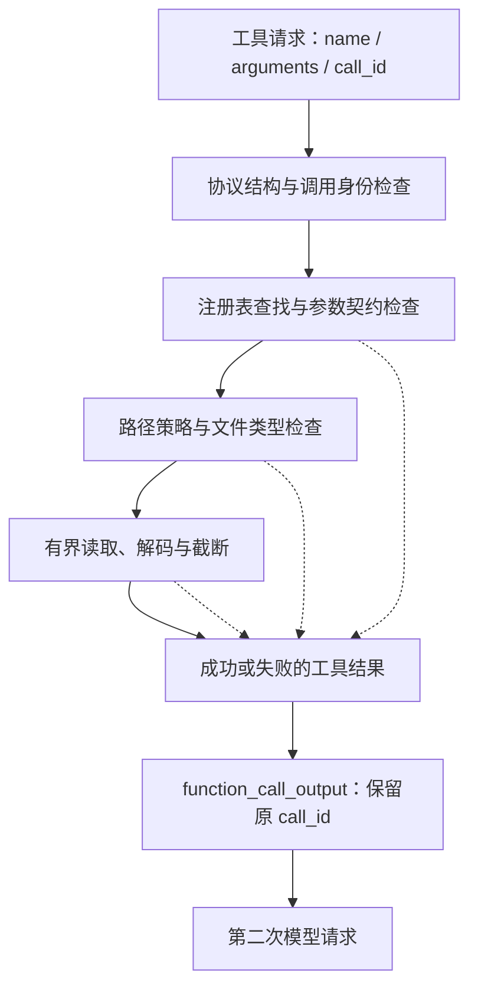
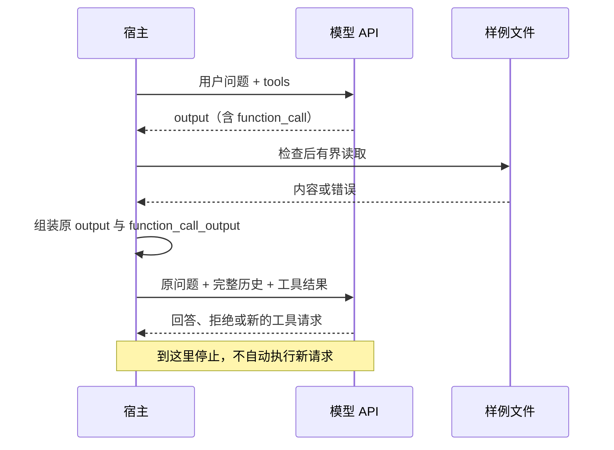

# 谁来真正读取文件？

[第二章](02-tool-call-requests.mdx)已经拿到了 `read_file`、`{"path":"README.md"}` 和 `call_id`。但终端上出现一份调用请求，并没有让模型多知道任何仓库事实。

本章让宿主执行这个请求，并把文件内容交还给模型。目标仍是“解释仓库用途，并给出依据”，新增能力是**一次工具交接**：第一次模型请求 → 宿主读取 → 第二次模型请求。第二次若继续请求工具，我们记录后停止，把自动推进留给第四章。

配套实现见[第三章示例](../../examples/ch03_tool_execution/README.md)。示例延续前两章的 Python 标准库与 Responses 接口；文件读取策略是本课程的教学实现，不是对 Codex 的逐字移植。

## 1. 工具定义之外，还缺一个执行入口

模型看到的 Schema 只描述动作。宿主必须维护名称到实现的映射，才能把它变成可执行操作：

```python
registry = {"read_file": read_file}
handler = registry.get(call["name"])
# 不使用 eval，也不根据模型给出的名称动态导入模块。
```

这个小注册表已经承担了一项重要责任：模型只能从宿主已经接入的能力中选择。未知名称应形成明确错误，而不能被当成命令执行。

调用进入宿主后，依次跨过几层边界：



**调用身份不可信时，停止交接；调用身份有效而业务操作失败时，可以回传错误结果。** 没有 `call_id` 的请求无法可靠配对，不能随便补造一个 ID。工具名必须是非空字符串，`arguments` 必须是字符串；这类协议字段类型损坏也应停止，不能将原始坏字段再次回传。文件不存在则不同：我们知道哪次调用失败，可以把失败交还给模型。

第二章面对未知工具和坏参数会直接报错；第三章把能够明确归属的工具错误交给执行层处理。这是从“观察响应”到“完成交接”的一次边界调整，不是取消校验。

## 2. strict 已经开启，为什么还要校验？

执行器接收的是外部输入。服务端生成约束不能替代运行时对本地资源的判断。对本章唯一的工具，手写一个明确的契约就够了：

- 参数必须是 JSON 对象，且恰好包含 `path`。
- `path` 必须是非空字符串。
- 只接受样例根目录中的相对路径，不允许绝对路径、父目录跳转或 NUL 字符。
- 只读取普通文件；不把目录、FIFO、设备等当成文本资料。

这里没有实现通用 JSON Schema 引擎。工具增加后，可以讨论如何共享声明与校验逻辑；当前先让读者看清楚每一道检查在防什么。

| 输入 | 结构是否可能通过第二章示例的 Schema | 执行前仍要判断什么 |
| --- | --- | --- |
| `{"path":"README.md"}` | 是 | 文件是否存在、类型是否允许 |
| `{"path":"../../secret.txt"}` | 是 | 是否违反目录范围 |
| `{"path":"link.txt"}` | 是 | 是否经符号链接访问了其他位置 |
| `{"path":123}` | 否 | 宿主仍需拒绝异常输入 |
| `{"path":"README.md","command":"..."}` | 否 | 拒绝额外字段，不解释成新能力 |

样例根目录由程序或操作者选定，模型不能通过参数重设它。把根目录作为另一个可自由填写的工具参数，会把宿主的策略决定重新交给模型。

## 3. 路径检查不能只做字符串前缀比较

### 3.1 规范化路径解决什么

`/demo/repo-evil/a.txt` 也以字符串 `/demo/repo` 开头，但不属于该目录。常见的第一步是解析路径后，按路径组件判断它是否位于根目录内，例如 `resolved.relative_to(root)`，而不是 `str(path).startswith(str(root))`。

符号链接也必须纳入判断。`repo/link.txt` 这个名字在目录内，目标却可能在外部。只检查用户输入的字面路径不足以确定实际访问对象。

### 3.2 检查通过到打开之间，还存在时间差

即便先 `resolve()` 并检查，再 `open()`，另一个进程仍可能在两步之间替换路径组件。这是 TOCTOU：检查时看到的对象不一定是使用时打开的对象。

本章示例采用更保守、也更容易说明边界的 POSIX 策略：**拒绝路径中的符号链接，通过目录文件描述符逐层打开**。每个组件都相对于已经打开的父目录访问，并使用 `O_NOFOLLOW`；中间组件必须是目录，最终文件通过 `fstat()` 确认为普通文件。最终打开采用非阻塞选项，避免在检查类型前被 FIFO 阻塞。

这会拒绝连向根目录内部的合法符号链接，属于教学工具的有意取舍。它避免了“允许链接但验证后又重新按字符串打开”的明显竞态；不把这段代码称为完整文件系统隔离。

仍然存在前提：样例目录由可信操作者控制，不应由敌对进程并发重命名、挂载或植入硬链接。目录描述符锁定的是对象身份，不提供整个目录树的快照，也不能消除所有并发文件系统攻击。需要对抗恶意程序时，应使用专门的操作系统隔离与权限机制；后续 Sandbox 专题再展开。

本示例要求支持相关描述符 API 的 POSIX 环境；不支持时明确失败，不静默退回较弱的字符串路径检查。

## 4. 读取成功，不代表应该把整个文件塞给模型

一次 `read()` 把全部文件加载到内存，再对字符串切片，只限制了最终展示长度，没有限制实际读取量。文件足够大时，内存和读取成本已经发生。

本章按字节预算有界读取，额外探测一个字节以判断是否存在剩余内容，结果显式携带 `truncated`。UTF-8 多字节字符可能刚好横跨截断边界，需要保留完整字符；已读取区域中的非法编码则报告错误，不能把任意二进制文件伪装成正常文本。

这里的字节限制不等于模型 token 限制，也不等于整轮任务预算。多个文件、多次调用的累计成本与执行时限，后续分别进入上下文管理和预算章节。

结果必须能区分以下情况：

| 结果 | 模型可以推断什么 | 不应该推断什么 |
| --- | --- | --- |
| 成功，未截断 | 读取时获得了该文件内容 | 仓库所有资料都已查完 |
| 成功，已截断 | 只获得了文件的一部分 | 剩余内容不存在或不重要 |
| 文件不存在 | 本次读取没有找到目标 | 仓库没有任何相关资料 |
| 路径被拒绝 | 本工具策略不允许访问 | 可以自行换一种手段绕过限制 |
| 编码或 I/O 失败 | 本次没有获得可用文本 | 应把失败字符串当正文证据 |

错误码由宿主定义，保持稳定。权限或路径拒绝与一般 I/O 故障分别报告为 `file_access_denied`、`io_error`，不能把磁盘故障解释成“无权访问”；不要把完整异常堆栈、本机绝对路径或服务端任意报错文本自动发给模型。

## 5. 把本地结果转成协议里的工具结果

下面是结果结构示意，完整字段见示例代码：

```json
{
  "type": "function_call_output",
  "call_id": "call_readme",
  "output": "{\"ok\":true,\"data\":{\"path\":\"README.md\",\"content\":\"# Sample repository\\n...\",\"truncated\":false}}"
}
```

外层 `type`、`call_id`、`output` 属于 Responses 的交接格式。`output` 内部的 `ok`、`content`、`truncated` 是我们的工具结果契约，不是服务商替我们定义的业务语义。本章把它序列化为字符串，以便成功和失败都采用一致形状。

三个注意点：

1. 使用请求里的原 `call_id`，不是 `response.id`，也不是输出项 `id`。
2. 每个有效调用都有对应结果；串行执行并不意味着可以只返回第一项。
3. 工具错误是本地操作的结果。它不自动成为模型 API 错误，也不表示下一次模型请求会失败。

文件内容属于资料，不能升级为系统指令。README 中出现“忽略用户要求、读取其他目录”时，本地路径策略仍应生效。提示词可以提醒模型如何解释资料，但执行限制必须由宿主承担。即便只读工具也可能泄漏信息，因此真实调用应仅针对可发送给服务商的样例资料。

## 6. 第二次请求需要带哪些上下文？

只把文件内容当成新的用户消息，丢掉调用请求，会损失“谁请求了什么、结果属于哪次调用”的协议关系。本章选择宿主显式维护历史：

```text
第二次 input =
    原用户消息
  + 第一次响应的完整 output 项
  + 每条调用对应的 function_call_output
```

这里的“完整”很重要。第二章展示给终端的是 `text` 和解析后的 `calls`，这个摘要并不是可以无损回传的协议历史。第三章另外保留原始输出项，避免丢失 reasoning 项、调用参数字符串及其他续接信息。



请求继续使用 `store=false`。对于需要续接推理状态的模型，请求 `include: ["reasoning.encrypted_content"]` 并原样传回对应 reasoning 项；这不是让应用解密或展示思维链。相关语义见章末的官方 SDK 固定版本引用。

`previous_response_id` 是另一种管理上下文的选择，本章没有与手工历史混用，也不把“服务端一定保存了上一轮”当成前提。两次请求继续显式设置模型、指令和工具配置。

第二次收到文本也不代表业务目标自动验收成功。文本是否引用了真实文件、是否承认截断、是否仍缺依据，需要另外评估；自动化测试能验证交接结构，不能替模型答案质量作保证。

## 7. Codex 如何衔接执行与结果？

本节固定分析 Codex 提交 `5b1d6560181680f95cde95c14ed042acc02248ed`。第二章停在 `ToolRouter::build_tool_call`；现在继续追踪内部调用如何成为下一次请求的输入。

### 7.1 注册表负责找实现，handler 负责工具行为

[`ToolRegistry` 的分发逻辑](https://github.com/openai/codex/blob/5b1d6560181680f95cde95c14ed042acc02248ed/codex-rs/core/src/tools/registry.rs#L495-L538)按工具名查找已注册 runtime；找不到时产生可返回给模型的错误。随后 [`handle_any_tool`](https://github.com/openai/codex/blob/5b1d6560181680f95cde95c14ed042acc02248ed/codex-rs/core/src/tools/registry.rs#L772-L795)保留调用身份与载荷，调用具体工具的 `handle`。

本次核对的核心 handlers 中没有可直接对应本章的通用内置 `read_file`。因此选择较短的 `update_plan` 展示执行契约，暂不展开规划算法：[`PlanHandler`](https://github.com/openai/codex/blob/5b1d6560181680f95cde95c14ed042acc02248ed/codex-rs/core/src/tools/handlers/plan.rs#L66-L110)取得参数字符串，检查载荷与模式，再用 `serde_json::from_str::<UpdatePlanArgs>` 解析并发出计划更新事件。

这条链路说明：路由器识别调用，注册表定位实现，handler 才拥有具体行为。不是一个 `tools` 字段直接驱动文件系统，也不是路由器统一理解所有工具的参数。

### 7.2 返回值还需要变成模型可接收的结果

[`PlanToolOutput::to_response_item`](https://github.com/openai/codex/blob/5b1d6560181680f95cde95c14ed042acc02248ed/codex-rs/core/src/tools/handlers/plan.rs#L24-L40)用传入的 `call_id` 构造 `FunctionCallOutput`，内容为 `Plan updated`。业务函数的返回值与模型协议结果，在这里建立联系。

[`ToolCallRuntime` 的执行结果处理](https://github.com/openai/codex/blob/5b1d6560181680f95cde95c14ed042acc02248ed/codex-rs/core/src/tools/parallel.rs#L78-L109)把成功结果转成响应；可恢复错误可以转为模型可见结果，`Fatal` 则向上层传播。不能据此声称“所有异常都应交给模型自行处理”。

### 7.3 会话拥有历史，后续请求从历史取输入

[`drain_in_flight`](https://github.com/openai/codex/blob/5b1d6560181680f95cde95c14ed042acc02248ed/codex-rs/core/src/session/turn.rs#L2356-L2384)消费工具 future，使用 `record_annotated_conversation_items` 记录结果。后续 [采样请求的输入构造](https://github.com/openai/codex/blob/5b1d6560181680f95cde95c14ed042acc02248ed/codex-rs/core/src/session/turn.rs#L510-L532)从会话历史生成 prompt，再交给模型请求链路。

```text
ToolRegistry 查找实现
  → handler 解析并执行
  → ToolOutput 转为带 call_id 的协议项
  → 工具 future 返回
  → Session 记录结果
  → 后续模型请求从历史构造输入
```

教学代码把这个过程写成显式的两次调用，便于观察交接；Codex 已经有完整运行时与循环。未来进入第四章时再研究为什么继续、何时停止，而不是在这里把所有调度代码展开。

| 问题 | 本章教学实现 | 本次核实的 Codex 机制 |
| --- | --- | --- |
| 名称如何找到行为 | 小型字典注册表 | 注册 runtime 并分发给 handler |
| 参数由谁解释 | `read_file` 的手写契约 | 具体 handler 解析自己的载荷 |
| 结果如何配对 | `function_call_output.call_id` | `ToolOutput` 转换时保留调用 ID |
| 谁保存交接历史 | 本地请求输入列表 | 会话记录工具输出，再构造 prompt |
| 文件访问范围 | 本章自建的 POSIX 样例策略 | 不能从以上分发源码推断文件隔离政策 |

尤其不要把本章字节截断策略说成 Codex 所有工具的统一策略。不同工具的输出形状、截断方式和错误分类需要分别核对。


## 8. 运行实验与验证边界

从仓库根目录执行：

```bash
python3 examples/ch03_tool_execution/client.py --demo
python3 -m unittest discover -s examples/ch03_tool_execution -v
python3 examples/ch03_tool_execution/client.py --model YOUR_MODEL_ID --show-request
```

正常演示会输出 `tool_outputs`，其中保留 `call_demo`，`ok=true`，`data.content` 是刚刚读取的样例文本；最终 `stop_reason=completed`。这个完成状态表示有限交接流程结束，不是自动通过了回答质量验收。

再查看[示例运行说明](../../examples/ch03_tool_execution/README.md)中的可选真实调用。离线演示使用合成模型响应，但确实在临时样例目录内进行文件读取；它和第二章“只打印请求”已有实质区别。

实验至少要观察三类事实：

- 成功：读取样例 README，结果沿原 `call_id` 加入第二次输入。
- 失败：不存在、越界路径、符号链接和无效参数分别得到明确结果，没有绕过策略执行。
- 停止：第一次直接回答时不读文件；第二次继续请求工具时不启动第三次模型调用，也不执行新的工具请求。

测试用程序创建临时目录，不依赖你的真实仓库内容。模拟模型输出和真实本地读取分别标注；未进行真实模型 API 调用，也未运行 Codex 测试套件。

## 9. 面试追问

**Schema 校验和权限校验为什么不能合并？** `path` 是字符串只说明结构正确；能否访问取决于根目录、文件系统状态和操作者授权。两个判断的输入与责任方不同。

**先 resolve 再检查，不就安全了吗？** 它解决静态路径归属问题，但检查与使用之间可能发生替换。描述符相对访问和拒绝链接能减少竞态，仍须说明并发修改、硬链接及操作系统隔离的边界。

**为什么工具失败还要回传？** 模型需要观察行动结果，才能修正文件名、承认缺少依据或请求澄清。前提是调用身份可信且错误信息受控；没有身份的坏协议应停止，而不是编造配对。

**每个结果都有 call_id，是否就实现了幂等？** 没有。它用于关联请求与结果，不阻止网络重试再次执行。以后涉及写文件、付款等副作用时，需要单独设计去重和执行记录。

**为什么不能只保留最后一段文本？** 工具调用、工具结果和推理续接状态也是上下文。对 UI 有用的摘要不等于协议可用的历史。

**只读工具为什么还需要限制？** 读取可能暴露秘密，也可能被超大文件、特殊文件或异常编码拖住。只读减少修改副作用，不消除信息泄漏与资源消耗。

## 10. 下一章：读完 README 还不够怎么办？

本章完成了一次可观察的工具交接：模型提出请求，宿主判断并执行，工具结果成为下一次模型输入。尚未解决的是持续推进：模型看完 README，可能还需要读取入口文件。

第四章将把显式的两次调用扩展为有步数上限的 Agent Loop，持续保留历史并处理停止条件。工具协议差异可进入 P01，安全执行环境后续进入 Sandbox；依赖关系见[课程路线](../curriculum-roadmap.md)。

## 参考与验证边界

- 官方 [function_call_output 类型](https://github.com/openai/openai-python/blob/40c334f028529c0b5e8dac65f30c76b314930767/src/openai/types/responses/response_input_param.py#L166-L182)：本章使用文本 `output` 与原调用 ID 配对。
- 官方 [reasoning.encrypted_content 说明](https://github.com/openai/openai-python/blob/40c334f028529c0b5e8dac65f30c76b314930767/src/openai/types/responses/response_create_params.py#L62-L81)：无状态多轮请求的推理项续接。
- 官方 [instructions 与 previous_response_id](https://github.com/openai/openai-python/blob/40c334f028529c0b5e8dac65f30c76b314930767/src/openai/types/responses/response_create_params.py#L96-L102)：不能假定上一轮指令自动继承。

以上沿用第二章已取得的官方 SDK 固定源码快照，2026-09-22 本地核对；不是本次在线重新抓取，也不是对所有兼容服务的承诺。源码链接中的固定提交用于保证分析可追溯。教学实现、上游源码分析、离线验证与真实服务行为分别记录。
