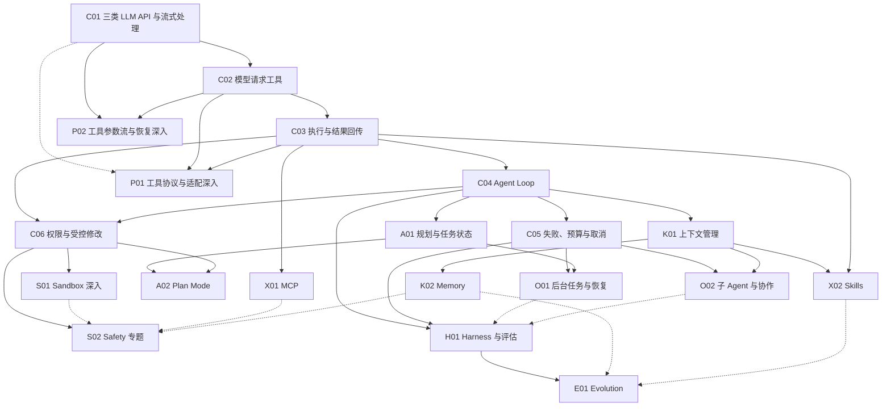

# 从一次模型调用到完整 Agent：课程路线草案

状态：v0.3，2026-09-18。面向程序员，中文优先。[第一章](chapters/01-llm-apis-and-streaming.mdx)已包含三类 API 与流式处理，其余章节为设计草案，随案例研究调整。

## 读者与贯穿场景

面向已有编程经验、希望系统理解 Agent 的程序员。默认读者熟悉 HTTP、JSON、基本异常处理与开发工作流，基础操作只保留必要提示，把篇幅用于机制、协议差异、失败语义和工程取舍。

初版 Markdown/MDX 以中文编写，中文课程完结后再建设多语言。覆盖面试中值得准备的核心技术问题和追问，以源码和实验支撑回答；不将课程限制为面试题集，也不把未经统计的问题标为高频。

贯穿任务是：**“这个代码仓库做什么？请找到依据；随后按要求修改一处行为，并验证修改。”**

教学使用一个小型、可控的样例仓库。从回答问题，到读取文件、连续调查，再到受控修改和验证，逐步增加任务难度。每章延续同一个教学 Agent；场景条件改变时明确说明。教学顺序不代表所有真实 Agent 的历史或架构。

每章遵循：**场景 → 当前问题 → 最小方案 → 实现与观察 → 新问题**。真实项目的源码案例用于解释工程选择，不能拿教学示例替代真实实现的证据。

## 三种阅读入口

- **学习路线**：为初学者推荐一条可运行、可验证的能力演进路径。
- **技术专题**：深入工具、协议、Sandbox、Memory 等机制，标出必要前置知识。
- **项目导读**：沿一个项目的入口、模块边界和完整任务流程阅读，链接到共享的专题案例。

同一份源码分析只维护一处，由不同入口引用。一个主题可以先浅后深，但不会因为与当前章有关，就成为读下一章的强制前置。

## 依赖图与推荐顺序

实线表示本草案中的前置依赖；虚线表示可选延伸或综合关联。首批推荐顺序为 C01 → C02 → C03 → C04 → C05 → C06。这是推荐阅读顺序，其中 C06 的直接前置是 C03 与 C04。

图中并非所有高级主题都要等首批六章结束后才能阅读。例如理解 C03 后就能进入 MCP 专题；Safety 与 Harness 的概念也会在早期出现，随后再集中深入。

三类 API 的基本请求／响应对照与文本流式处理已进入 C01。P01、P02 不再重复第一章，分别深入工具协议适配、工具参数增量和中断恢复，需先理解 C02 的工具请求。

## 首批六章

### C01：一次模型调用如何接入 Agent？——三类 API 与流式处理

- **场景与问题**：让模型解释一个未提供源码的仓库；程序需要可靠地接收回答，还要区分生成完成、截断与失败。
- **前置**：HTTP、JSON、基本程序与异常处理；不展开通用编程入门。
- **新增能力**：比较 OpenAI Chat Completions、OpenAI Responses、Anthropic Messages 的请求与响应；发出普通或流式请求，解析 SSE 并聚合文本、用量和终态。
- **最小实现**：Python 标准库示例，显式分开三个 API 的构造与解析；保留协议差异，不引入统一 Agent 框架。提供无密钥离线回放和可选真实调用。
- **源码入口**：以 Codex 的 Responses 请求构造与流事件处理为主；其他 API 的差异由官方接口／SDK 资料及 Pi 补充，不将三类 API 都归为 Codex 实现。
- **验收**：测试跨网络分片的 UTF-8／SSE 解析、三种结束信号、HTTP 200 后的流内错误、EOF 提前断流、用量处理与输出截断；明确离线通过和真实调用验证的区别。
- **图解**：请求到响应的边界、流式事件生命周期；给出完成与失败分支。
- **面试追问**：为什么三种 API 不可只换 URL？SSE 是否一事件一 token？为什么 HTTP 200 或文本 done 都不足以证明整个生成成功？
- **新问题**：可靠收到回答仍不等于获得仓库依据，`tools` 如何让模型提出读取文件的请求？进入 C02。工具字段转换与工具参数流在 P01／P02 深入。

### C02：模型说要读文件，文件就会被读取吗？——工具调用请求

- **前置**：C01。
- **新增能力**：给请求附加 `read_file` 的名称、说明和参数 Schema，识别模型返回的工具请求。
- **最小实现**：打印工具名、参数和调用 ID，**暂不执行工具**。说明 `tools` 是能力描述，输出的请求不是已经发生的执行。
- **源码入口**：Codex 的请求工具定义与 `ToolRouter::build_tool_call`，区分传输结构和内部工具调用；Pi 仅在协议适配差异有助于理解时补充。
- **验收**：对预设文本响应与工具响应分别处理；读者可指出参数与工具结果的区别。真实模型未选择工具时如实展示，不把一次特定选择写成模型必然行为。
- **图解**：模型生成调用请求后暂停，文件系统一侧保持未执行状态。
- **新问题**：哪个程序执行请求？参数是否可信？进入 C03。工具调用与结果回传的跨 API 适配在理解 C03 后进入 P01。

### C03：谁来真正读取文件？——宿主执行与结果回传

- **前置**：C02。
- **新增能力**：用工具注册表找到执行函数，校验输入，读取样例文件，将结果关联到原调用 ID，并手工发起第二次模型请求。
- **最小实现**：只提供样例目录内的只读文件工具。校验参数类型、规范化路径、检查解析后的路径边界并限制输出量；不提供任意 Shell。这是应用层限制，不宣称为 OS 级 Sandbox。
- **源码入口**：Codex 的工具路由、执行与结果回填链路，沿 `ToolRouter` 与 `stream_events_utils` 跟踪；Hermes 按需补充调度差异。协议中的结果表示与宿主执行函数分别讲解。
- **验收**：正常读取、未知工具、非法参数、越界路径、符号链接指向目录外、文件不存在和输出超限都有可观察结果；回传保持调用 ID 对应关系。测试目录由程序建立，不依赖读者的真实文件。
- **图解**：工具请求 → 校验 → 执行 → 工具结果 → 第二次 LLM 调用。
- **新问题**：读完 README 又要查入口文件，谁来持续推进？进入 C04。工具接入其他服务延伸到 X01，执行权限问题先在 C06 展开。

### C04：读完一个文件之后，谁决定下一步？——Agent Loop

- **前置**：C03。
- **新增能力**：把手工第二次请求改成循环，保留消息与工具结果，让模型继续选择行动。
- **最小实现**：先串行执行工具请求，处理完整一轮中的工具结果，再继续请求；没有工具请求时结束。第一版就设置最大步数，避免无限运行；暂不引入后台任务与并行执行。
- **源码入口**：以 Codex `session/turn.rs` 中的 `run_turn` 和 `needs_follow_up` 为主，解释模型后续需要、待处理输入与停止阶段；Pi 和参考项目 s01 作为较小循环的对照。
- **验收**：用可控响应序列验证“读 README → 读入口 → 回答”、直接回答和达到步数上限三条路径；最终解释附样例文件依据。模拟测试通过不等于真实模型任务成功，真实调用另记结果。
- **图解**：可单步推进的消息时间线，显示调用次数、工具执行与退出原因。
- **新问题**：工具报错、连接中断或用户取消时怎么办？进入 C05；跨多个步骤的任务组织延伸到 A01，上下文累积延伸到 K01。

### C05：它失败了，应该重试还是停下来？——预算、错误与取消

- **前置**：C04。
- **新增能力**：区分模型请求失败、工具执行失败与任务未完成；记录明确的停止原因，加入超时和取消。
- **最小实现**：可配置步数与时间预算、有限重试及错误结果。区分执行前失败与执行后响应丢失；说明将来有副作用的工具不能一律自动重试。
- **源码入口**：以 Codex 的继续／停止条件与工具调用取消信号为阅读入口；预算与重试细节在本章编写时继续核实。Hermes 的迭代上限作为差异案例，不能直接当成 Codex 行为。
- **验收**：工具持续报错、请求暂时失败、超时、取消、预算耗尽均有确定的终态；停止后不再启动新工具。对于正在运行的操作，明确支持哪种取消语义，不能把停止等待称为已经终止进程。
- **图解**：状态转移图与每次重试消耗的预算。
- **新问题**：用户要求修改文件时，什么操作可以执行？推荐继续 C06。长任务恢复延伸到 O01。

### C06：用户让它修改代码，什么操作可以执行？——权限与受控副作用

- **前置**：C03、C04；推荐先读 C05。
- **场景变化**：任务从“解释仓库”变成“修改一处样例行为”。
- **新增能力**：把模型意图、授权决定和实际执行分开；加入样例文件修改工具，展示允许、拒绝与需要审批的路径。
- **最小实现**：限定可写目标，展示具体修改，再依据策略执行；记录操作结果。执行测试命令属于后续 Sandbox 实验，不在此静默引入任意 Shell。
- **源码入口**：Codex `ToolOrchestrator::run` 与 `ExecApprovalRequirement`，观察权限判断怎样连接执行环境；参考项目 Permission 章用于教学表达对照。
- **验收**：被拒绝的调用不发生写入；批准只覆盖对应操作；修改前后差异可核验；路径边界继续有效。明确这些检查没有提供完整的系统隔离。
- **图解**：模型请求 → 策略／审批 → 执行环境 → 结果，分开标出授权与隔离。
- **新问题**：命令会启动子进程和访问网络，文件工具的限制还够吗？进入 S01；“只允许先规划”进入 A02。

## 后续专题：方向已定，章节粒度待试讲

以下是覆盖范围，不是已完成章节或已证明的项目能力。案例选择与研究深度见 [源码案例调研](source-study.md)。

| 编号与主题 | 触发场景／问题 | 必要前置 | 最小学习产出与下一问题 |
| --- | --- | --- | --- |
| P01 工具协议与适配深入 | 工具调用、结果回传和多轮状态如何跨 API 表示？ | C02、C03 | 在 C01 的三类 API 对照上，深入调用 ID、Schema、结果关联及状态传递；讨论适配层的信息损失 |
| P02 工具参数流与恢复深入 | 工具参数还没生成完能否执行？断流如何恢复？ | C01、C02 | 复用 C01 的 SSE 与文本终态知识，深入多调用增量聚合、参数完成与校验、中断恢复；不把重新请求等同续传 |
| S01 Sandbox | 工具需要执行命令、访问网络，如何限制影响范围？ | C06 | 在经验证的隔离环境执行样例测试，观察文件、网络与子进程边界；区别审批、应用校验、worktree 与系统隔离，并标明平台限制 |
| A01 规划与任务状态 | 多步骤任务容易漏项，如何记录进度与调整计划？ | C04 | 显式计划、任务状态与验证结果；区分写出计划文本与运行时调度，继续到 A02 或 O01 |
| A02 Plan Mode | 用户只想评估方案，如何避免提前产生修改？ | A01、C06 | 定义阶段转换与允许的动作，验证实际执行限制；不把一句提示词当成权限机制 |
| K01 上下文管理 | 仓库内容和历史越来越多，下一次请求该带什么？ | C04 | 观察消息组成，按需检索、截断与压缩，检查工具调用配对和关键信息保留；引出跨会话信息 |
| K02 Memory | 新会话如何使用旧经验，又避免使用过时信息？ | K01 | 区分会话记录、长期记忆、检索与更新；处理来源、作用域、失效和删除 |
| X01 MCP | 多个 Agent 如何接入同一外部工具服务？ | C03 | 走通发现、Schema 转换、调用与错误回传；协议互通不自动提供授权或安全隔离 |
| X02 Skills | 同一套任务方法如何复用，又不一直占据上下文？ | C03、K01 | 分析发现、按需加载、指令／资源与工具的关系；区分知识加载和执行能力，讨论依赖与信任 |
| O01 后台任务与恢复 | 长任务不能阻塞交互，重启后如何继续？ | C05、A01 | 任务身份、状态持久化、取消、恢复与重复执行控制；调度器作为后续分支 |
| O02 子 Agent 与协作 | 一份上下文难以容纳多项独立调查，怎样分工？ | C05、K01 | 子任务输入输出、上下文隔离、汇合和失败传播；再讨论并行、共享文件冲突与团队协议 |
| S02 Safety | 外部文件、工具输出和记忆能否改变执行规则？ | C03、C06；具体专题按需补前置 | 用输入来源、权限与数据流分析提示注入和泄漏，配攻击／拒绝案例；持续评估而非宣称一次配置解决所有风险 |
| H01 Harness 与评估 | 单个循环能运行，怎样判断整个系统可靠？ | C04、C05 | 汇总模型外部的上下文、工具、权限、事件与验证机制；建立固定任务、轨迹、质量／成本指标和回归检查。高级模块可逐步接入 |
| E01 Evolution | 如何证明一次策略或 Skill 更新真的更好？ | H01；涉及记忆／Skill 时需 K02／X02 | 基于失败证据提出修改，用独立评估验证，保留版本与回滚；不把“写入记忆”直接称为自我进化 |

## 源码案例安排

**以 OpenAI Codex 为贯穿课程的主要源码学习项目**，沿实际调用链解释模型接入、工具、循环、上下文、权限与其他已核实机制。Pi、Hermes 等仅在存在有价值的差异，或主题超出已核实的 Codex 范围时补充。

教学示例仍用于展示最小机制，与 Codex 的 Rust 实现分开标注。第一章保留三类 API 与流式处理，但主案例只讲已核实的 Codex Responses 链路，不据此推断它实现了另外两类 API。

采用一个主案例加必要的差异案例，不要求每章覆盖所有项目。项目导读先解释阅读目标、调用入口和版本，再链接到专题中的具体函数。对比时对齐同一个问题，例如“什么条件下继续循环”，不能仅比较类名或代码行数。

参考项目 `learn-claude-code` 用于学习章节衔接与渐进实现；它的教学代码与 Pi、Hermes、Codex 的源码证据分开标注。

## 第一章试写与网站落地

1. **第一章教学语言**：使用 Python 标准库直接展示 HTTP、SSE 和 JSON 边界，不要求安装模型 SDK；后续交互组件可独立使用 TypeScript。
2. **第一章接口范围**：同时讲解 OpenAI Chat Completions、OpenAI Responses 和 Anthropic Messages；模型通过运行参数指定，不将模型名称写死为永久有效。离线回放不依赖凭证，真实调用单独验证。
3. **第一章交付物**：可运行脚本、配置说明、请求／响应示意、离线样本、一次真实调用记录（条件具备时）、失败处理说明和下一章问题。凭证缺失时明确真实验证缺口。
4. **最小网站**：在第一章样稿完成后搭建 Docusaurus，验证正文、代码、图示、前后章链接和移动端阅读；再决定哪些图需要交互组件。
5. **后续落地**：完成 C01–C04 的最小闭环，再根据读者理解成本细化高级章节；不先实现整套框架或铺满占位页面。

## 每章验收与源码对比模板

- 入口问题、必要前置、本章新增机制，以及相对上一章的代码变化。
- 教学示例与上游实现分别标注；案例包含项目、固定提交、文件、符号和源码链接。
- 展示一条正常路径和与本章机制相关的失败／边界路径；分别记录离线测试、真实调用和未验证部分。
- 对比统一使用“问题、前提、实现机制、失败处理、代价、适用条件”，证据不足时写待验证。
- 提供与本章机制对应的面试追问，解释推理过程、边界和取舍，避免只列名词定义。
- 结束时给出新增能力、剩余问题、推荐下一章和可选分支。
- 不复制上游大段代码；引用或改编时核对许可证与署名要求。本次草案只建立索引和设计，没有复制教学实现。
