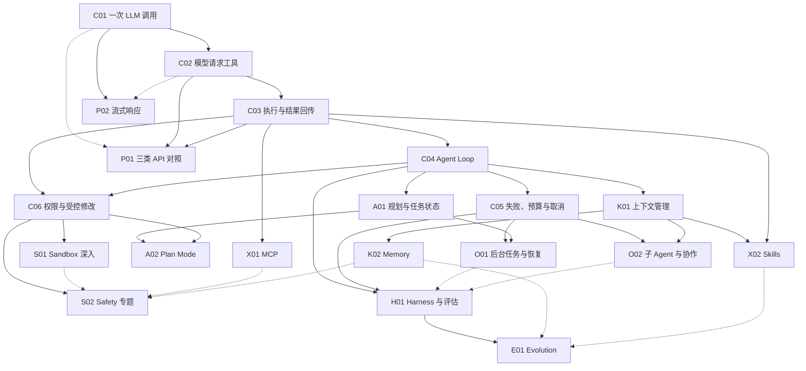

# 从一次模型调用到完整 Agent：课程路线草案

状态：v0.1，2026-09-17。本文是课程设计，章节与演示尚未实现。首批章节可以开始编写，后续专题随案例研究调整。

## 读者与贯穿场景

面向会编写基本程序、尚未系统理解 Agent 的开发者。不要求读者预先掌握某个 Agent 框架；涉及 HTTP、JSON 和异步执行时提供必要说明。

贯穿任务是：**“这个代码仓库做什么？请找到依据；随后按要求修改一处行为，并验证修改。”**

教学使用一个小型、可控的样例仓库。从回答问题，到读取文件、连续调查，再到受控修改和验证，逐步增加任务难度。每章延续同一个教学 Agent；场景条件改变时明确说明。教学顺序不代表所有真实 Agent 的历史或架构。

每章遵循：**场景 → 当前问题 → 最小方案 → 实现与观察 → 新问题**。真实项目的源码案例用于解释工程选择，不能拿教学示例替代真实实现的证据。

## 三种阅读入口

- **学习路线**：为初学者推荐一条可运行、可验证的能力演进路径。
- **技术专题**：深入工具、协议、Sandbox、Memory 等机制，标出必要前置知识。
- **项目导读**：沿一个项目的入口、模块边界和完整任务流程阅读，链接到共享的专题案例。

同一份源码分析只维护一处，由不同入口引用。一个主题可以先浅后深，但不会因为与当前章有关，就成为读下一章的强制前置。

## 依赖图与推荐顺序

实线表示本草案中的前置依赖；虚线表示可选延伸或综合关联。首批推荐顺序为 C01 → C02 → C03 → C04 → C05 → C06。这是推荐阅读顺序，其中 C06 的直接前置是 C03 与 C04。

图中并非所有高级主题都要等首批六章结束后才能阅读。例如理解 C03 后就能进入 MCP 专题；Safety 与 Harness 的概念也会在早期出现，随后再集中深入。

P02 的基础文本流式部分只需 C01；图中 C02 的虚线表示可选择继续学习工具增量部分。一旦选择该部分，C02 就是必要前置，而不是可跳过的知识。

## 首批六章

### C01：模型没有看过仓库，为什么还能给出答案？——一次 LLM 调用

- **场景与问题**：只给模型一个仓库名称并询问用途。它可以生成回答，但我们无法从回答本身确认它掌握了仓库事实；不以“模型必定编造”为实验前提。
- **前置**：基本程序、JSON 与环境变量；提供运行准备说明。
- **新增能力**：发出一次非流式请求，观察输入、输出及基本用量信息（接口提供时）。先选一个 API，不做统一 Provider 抽象。
- **最小实现**：配置模型和凭证，发送一条用户消息，提取文本；明确提示认证、连接等失败。日志展示请求结构，但不输出密钥。
- **源码入口**：参考教学项目的 `client.messages.create` 调用片段，严格摘出一次调用；Pi 的 Provider 实现作为后续源码阅读入口，见 [源码案例调研](source-study.md)。
- **验收**：读者能完成一次真实调用，指出请求中的模型、消息及返回文本；缺少凭证时得到明确失败信息。离线响应样本与真实请求结果分别标记。
- **图解**：用户程序 → API → 响应，标明此时没有自动访问本地仓库。
- **新问题**：模型需要依据，怎样表达“我要读取一个文件”？进入 C02。流式体验延伸到 P02。

### C02：模型说要读文件，文件就会被读取吗？——工具调用请求

- **前置**：C01。
- **新增能力**：给请求附加 `read_file` 的名称、说明和参数 Schema，识别模型返回的工具请求。
- **最小实现**：打印工具名、参数和调用 ID，**暂不执行工具**。说明 `tools` 是能力描述，输出的请求不是已经发生的执行。
- **源码入口**：Pi 的工具类型与 Provider 转换；Codex `ToolRouter::build_tool_call` 作为另一种解析边界的例子。
- **验收**：对预设文本响应与工具响应分别处理；读者可指出参数与工具结果的区别。真实模型未选择工具时如实展示，不把一次特定选择写成模型必然行为。
- **图解**：模型生成调用请求后暂停，文件系统一侧保持未执行状态。
- **新问题**：哪个程序执行请求？参数是否可信？进入 C03。完整 API 对照在理解 C03 的回传后进入 P01。

### C03：谁来真正读取文件？——宿主执行与结果回传

- **前置**：C02。
- **新增能力**：用工具注册表找到执行函数，校验输入，读取样例文件，将结果关联到原调用 ID，并手工发起第二次模型请求。
- **最小实现**：只提供样例目录内的只读文件工具。校验参数类型、规范化路径、检查解析后的路径边界并限制输出量；不提供任意 Shell。这是应用层限制，不宣称为 OS 级 Sandbox。
- **源码入口**：Pi 的工具执行函数；Hermes 的工具注册与分发作为工程案例。协议中的结果表示与宿主执行函数分别讲解。
- **验收**：正常读取、未知工具、非法参数、越界路径、符号链接指向目录外、文件不存在和输出超限都有可观察结果；回传保持调用 ID 对应关系。测试目录由程序建立，不依赖读者的真实文件。
- **图解**：工具请求 → 校验 → 执行 → 工具结果 → 第二次 LLM 调用。
- **新问题**：读完 README 又要查入口文件，谁来持续推进？进入 C04。工具接入其他服务延伸到 X01，执行权限问题先在 C06 展开。

### C04：读完一个文件之后，谁决定下一步？——Agent Loop

- **前置**：C03。
- **新增能力**：把手工第二次请求改成循环，保留消息与工具结果，让模型继续选择行动。
- **最小实现**：先串行执行工具请求，处理完整一轮中的工具结果，再继续请求；没有工具请求时结束。第一版就设置最大步数，避免无限运行；暂不引入后台任务与并行执行。
- **源码入口**：Pi 的 `runLoop` 为主，参考项目 s01 用于教学结构对照；Codex 的 `needs_follow_up` 留作“真实结束条件不止一种”的延伸。
- **验收**：用可控响应序列验证“读 README → 读入口 → 回答”、直接回答和达到步数上限三条路径；最终解释附样例文件依据。模拟测试通过不等于真实模型任务成功，真实调用另记结果。
- **图解**：可单步推进的消息时间线，显示调用次数、工具执行与退出原因。
- **新问题**：工具报错、连接中断或用户取消时怎么办？进入 C05；跨多个步骤的任务组织延伸到 A01，上下文累积延伸到 K01。

### C05：它失败了，应该重试还是停下来？——预算、错误与取消

- **前置**：C04。
- **新增能力**：区分模型请求失败、工具执行失败与任务未完成；记录明确的停止原因，加入超时和取消。
- **最小实现**：可配置步数与时间预算、有限重试及错误结果。区分执行前失败与执行后响应丢失；说明将来有副作用的工具不能一律自动重试。
- **源码入口**：Hermes 的迭代上限；Pi 的工具错误回传和取消信号；Codex 的继续条件用于说明待处理输入也可能推动后续执行。
- **验收**：工具持续报错、请求暂时失败、超时、取消、预算耗尽均有确定的终态；停止后不再启动新工具。对于正在运行的操作，明确支持哪种取消语义，不能把停止等待称为已经终止进程。
- **图解**：状态转移图与每次重试消耗的预算。
- **新问题**：用户要求修改文件时，什么操作可以执行？推荐继续 C06。长任务恢复延伸到 O01。

### C06：用户让它修改代码，什么操作可以执行？——权限与受控副作用

- **前置**：C03、C04；推荐先读 C05。
- **场景变化**：任务从“解释仓库”变成“修改一处样例行为”。
- **新增能力**：把模型意图、授权决定和实际执行分开；加入样例文件修改工具，展示允许、拒绝与需要审批的路径。
- **最小实现**：限定可写目标，展示具体修改，再依据策略执行；记录操作结果。执行测试命令属于后续 Sandbox 实验，不在此静默引入任意 Shell。
- **源码入口**：Codex `ToolOrchestrator::run` 与 `ExecApprovalRequirement`，观察权限判断怎样连接执行环境；参考项目 Permission 章用于教学表达对照。
- **验收**：被拒绝的调用不发生写入；批准只覆盖对应操作；修改前后差异可核验；路径边界继续有效。明确这些检查没有提供完整的系统隔离。
- **图解**：模型请求 → 策略／审批 → 执行环境 → 结果，分开标出授权与隔离。
- **新问题**：命令会启动子进程和访问网络，文件工具的限制还够吗？进入 S01；“只允许先规划”进入 A02。

## 后续专题：方向已定，章节粒度待试讲

以下是覆盖范围，不是已完成章节或已证明的项目能力。案例选择与研究深度见 [源码案例调研](source-study.md)。

| 编号与主题 | 触发场景／问题 | 必要前置 | 最小学习产出与下一问题 |
| --- | --- | --- | --- |
| P01 API 对照 | 换了接口，消息与工具结果为何不能直接照搬？ | C02、C03 | 对照 OpenAI Chat Completions、OpenAI Responses、Anthropic Messages 的请求、工具调用与回传；这是本课程选定的三类 API，不是行业只有三种协议。随后讨论适配层会丢失哪些差异 |
| P02 流式响应 | 等待完整答案太久，如何观察生成过程？ | C01；工具增量部分需 C02 | 事件拼接、完成信号、错误与取消；不在参数片段未完整时执行工具 |
| S01 Sandbox | 工具需要执行命令、访问网络，如何限制影响范围？ | C06 | 在经验证的隔离环境执行样例测试，观察文件、网络与子进程边界；区别审批、应用校验、worktree 与系统隔离，并标明平台限制 |
| A01 规划与任务状态 | 多步骤任务容易漏项，如何记录进度与调整计划？ | C04 | 显式计划、任务状态与验证结果；区分写出计划文本与运行时调度，继续到 A02 或 O01 |
| A02 Plan Mode | 用户只想评估方案，如何避免提前产生修改？ | A01、C06 | 定义阶段转换与允许的动作，验证实际执行限制；不把一句提示词当成权限机制 |
| K01 上下文管理 | 仓库内容和历史越来越多，下一次请求该带什么？ | C04 | 观察消息组成，按需检索、截断与压缩，检查工具调用配对和关键信息保留；引出跨会话信息 |
| K02 Memory | 新会话如何使用旧经验，又避免使用过时信息？ | K01 | 区分会话记录、长期记忆、检索与更新；处理来源、作用域、失效和删除 |
| X01 MCP | 多个 Agent 如何接入同一外部工具服务？ | C03 | 走通发现、Schema 转换、调用与错误回传；协议互通不自动提供授权或安全隔离 |
| X02 Skills | 同一套任务方法如何复用，又不一直占据上下文？ | C03、K01 | 分析发现、按需加载、指令／资源与工具的关系；区分知识加载和执行能力，讨论依赖与信任 |
| O01 后台任务与恢复 | 长任务不能阻塞交互，重启后如何继续？ | C05、A01 | 任务身份、状态持久化、取消、恢复与重复执行控制；调度器作为后续分支 |
| O02 子 Agent 与协作 | 一份上下文难以容纳多项独立调查，怎样分工？ | C05、K01 | 子任务输入输出、上下文隔离、汇合和失败传播；再讨论并行、共享文件冲突与团队协议 |
| S02 Safety | 外部文件、工具输出和记忆能否改变执行规则？ | C03、C06；具体专题按需补前置 | 用输入来源、权限与数据流分析提示注入和泄漏，配攻击／拒绝案例；持续评估而非宣称一次配置解决所有风险 |
| H01 Harness 与评估 | 单个循环能运行，怎样判断整个系统可靠？ | C04、C05 | 汇总模型外部的上下文、工具、权限、事件与验证机制；建立固定任务、轨迹、质量／成本指标和回归检查。高级模块可逐步接入 |
| E01 Evolution | 如何证明一次策略或 Skill 更新真的更好？ | H01；涉及记忆／Skill 时需 K02／X02 | 基于失败证据提出修改，用独立评估验证，保留版本与回滚；不把“写入记忆”直接称为自我进化 |

## 源码案例安排

首批暂定 **Pi 为主要真实源码案例，Hermes 为补充，Codex 用于权限与工程边界**。这是基于当前本地快照的可读性选择，可在第一章试写后调整。

采用一个主案例加必要的差异案例，不要求每章覆盖所有项目。项目导读先解释阅读目标、调用入口和版本，再链接到专题中的具体函数。对比时对齐同一个问题，例如“什么条件下继续循环”，不能仅比较类名或代码行数。

参考项目 `learn-claude-code` 用于学习章节衔接与渐进实现；它的教学代码与 Pi、Hermes、Codex 的源码证据分开标注。

## 第一章试写与网站落地

1. **教学语言建议**：先用 Python 写最小 Agent，降低入门代码量；Docusaurus 的 React 组件独立使用 TypeScript。此项是建议，尚未建立实现约束，试写前确认运行环境与维护成本。
2. **首个接口建议**：先用 Anthropic Messages 展示一次调用，与参考教学代码衔接；正式实现前核对官方接口及可用凭证。若实际可用接口不同，调整 C01 与 C02 的样例，不改变教学问题。本文不声称已完成接口连通测试。
3. **第一章交付物**：可运行脚本、配置说明、请求／响应示意、离线样本、一次真实调用记录（条件具备时）、失败处理说明和下一章问题。凭证缺失时明确真实验证缺口。
4. **最小网站**：在第一章样稿完成后搭建 Docusaurus，验证正文、代码、图示、前后章链接和移动端阅读；再决定哪些图需要交互组件。
5. **后续落地**：完成 C01–C04 的最小闭环，再根据读者理解成本细化高级章节；不先实现整套框架或铺满占位页面。

## 每章验收与源码对比模板

- 入口问题、必要前置、本章新增机制，以及相对上一章的代码变化。
- 教学示例与上游实现分别标注；案例包含项目、固定提交、文件、符号和源码链接。
- 展示一条正常路径和与本章机制相关的失败／边界路径；分别记录离线测试、真实调用和未验证部分。
- 对比统一使用“问题、前提、实现机制、失败处理、代价、适用条件”，证据不足时写待验证。
- 结束时给出新增能力、剩余问题、推荐下一章和可选分支。
- 不复制上游大段代码；引用或改编时核对许可证与署名要求。本次草案只建立索引和设计，没有复制教学实现。
